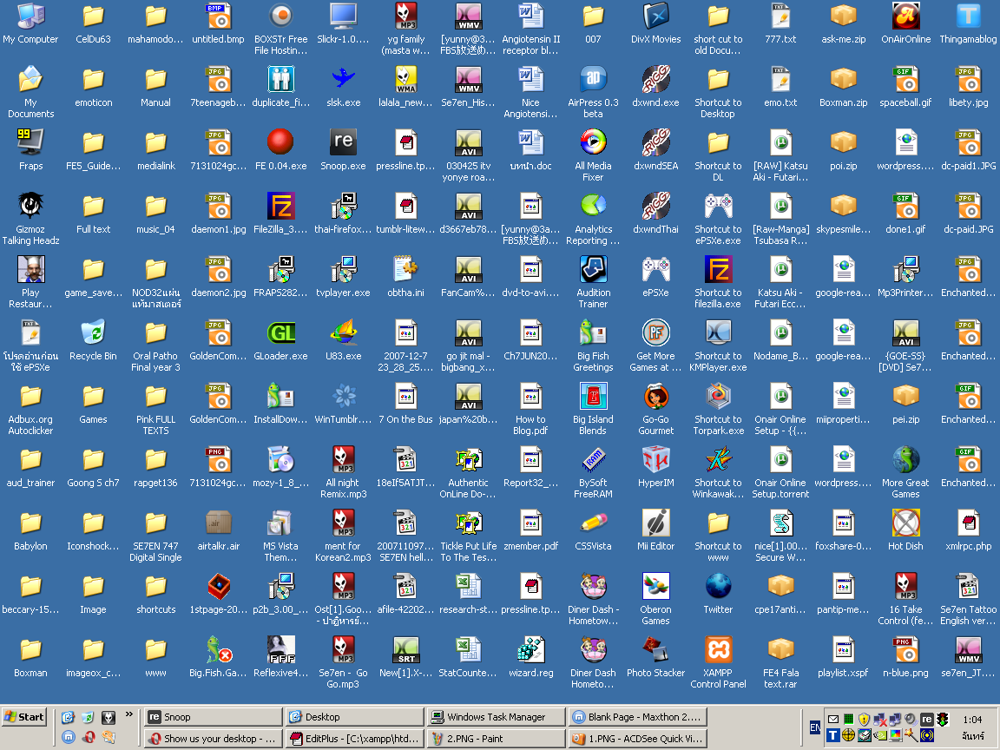

::: outcomes

* [X] Define your own strategy for organizing your files.
* [X] Build a directory structure with a visual file explorer for the purpose of
  organizing your files.

:::

Our computers are [full of files]. As you take more and more courses in
university, you're going to find that you're generating [a lot] of files.



Keeping your files organized can help when

* You need to study for a test or exam.
* An assignment you're currently working on builds on or uses ideas from an
  older assignment.
* You need to look back at the schoolwork you've done when you're applying for
  jobs.

Organizing your files isn't super hard. You need a simple plan about *how* you
want to organize your files so that when you're saving a new file for the first
time you know where to put it.

[a lot]:
https://hyperboleandahalf.blogspot.com/2010/04/alot-is-better-than-you-at-everything.html

Planning your organization
==========================

Try to come up with a high-level structure that uses information about the
files. Pick information about the files that are **facts** and aren't going to
change as time goes on (e.g., dates and years, course names and numbers,
departments, etc).

Files and folders are hierarchical (it's a tree :deciduous_tree:!), and you can
use facts about the files you're going to organize as parts of that tree
structure. When planning your organizational structure, try to keep the
information that's most important to finding what you're looking for close to
the top of the tree structure.

::: example

I am an instructor in the Department of Computer Science at the University of
Manitoba. My academic life revolves around academic years, terms, and courses. I
usually want to be able to find information about a specific course very
quickly, so course numbers are the highest level in my organizational structure.

My general strategy for organizing my files looks like this:

* Course number
    * Year
        * Academic term (e.g., fall, winter, summer)
            * Deliverable type (e.g., assignments, labs, tests, schedules)
                * Actual deliverables in those categories (e.g., assignment 1,
                  test 3, lab 2)
                    * Actual files for those deliverables (e.g.,
                      `assignment.md`, `test.tex`)

An actual folder structure that I have for a course that I teach regularly looks
like this:

::: {style='line-height: 1;'}

```
comp3430/
├── 2021
│   └── summer
│       ├── assignments
│       │   └── assignment1
│       │       └── assignment.md
│       ├── schedule
│       │   └── schedule.docx
│       └── tests
│           ├── test1
│           │   └── test.tex
│           └── test2
│               └── test.tex
└── 2022
    ├── summer
    │   ├── assignments
    │   │   └── assignment1
    │   ├── schedule
    │   └── tests
    │       ├── test1
    │       └── test2
    └── winter
        ├── assignments
        │   └── assignment1
        ├── schedule
        └── tests
            ├── test1
            └── test2
```

:::

Organizing *your* files exactly like this doesn't make sense --- you don't usually
take the same course across terms and years --- so you shouldn't use this exact
organizational strategy; you should make your own!

:::

Here are some examples of information about files that you can use to organize
your academic life:

* Faculty course is offered in (e.g., Arts, Science, Business, Engineering).
* Course number and name (e.g., comp1010, "SCI 2000", "HIST 1350 An Introduction
  to the History of Western Civilization to 1500").
* Academic year and/or term (e.g., 2022, Fall 2022, Winter).
* Types of homework that you need to work on for a course (e.g., labs,
  assignments, projects).
* Actual deliverable for the type of homework (e.g., "Lab 1", assignment4,
  "Final project").
* Status of the files that you create for the type of homework (e.g., "Draft 3",
  "Final", "Submitted").

You need to decide for yourself: Which of these are going to be names for
folders and which of these are going to be names of files?

[full of files]: https://www.youtube.com/watch?v=L_o_O7v1ews

Making folders
==============

Planning your strategy for organizing files is just the first step. Now you
actually have to make the folder structure!

Making folders with your file explorer (Finder in macOS, Explorer in Windows,
varies in Linux) is generally straightforward. You'll find that you can create
folders in several ways (some we'll see later).

<details><summary>Making new folders in Windows</summary>

Open Windows Explorer by doing one of the following:

* Click on the folder icon at the bottom of your screen.
* Click on the Microsoft logo in the corner of your screen, or press the
  Microsoft key (the "super" key) on your keyboard, then start typing
  "explorer". When you see "File Explorer" appear, click on it.

Windows Explorer shows a summary of the folders that you have on your computer
when first started. I would recommend that you start creating your folder
structure either on your Desktop or in your Documents folder. You should open
one of those folders by double-clicking on the icon.

Once you've opened either your Desktop or Documents folder, you can start
creating a new folder.

To create a new folder, you can do one of the following:

* Click on the "New Folder" or "New" &rarr; "Folder" buttons at the top of your
  Windows Explorer window.
* Right-click on empty space in the folder view area, then select "New" &rarr;
  "Folder".
* Press <kbd>Ctrl</kbd>+<kbd>Shift</kbd>+<kbd>N</kbd> on your keyboard.

The default name for a new folder is "New folder". You should change the name of
this new folder to be the name of the folder that you're currently creating.

Try creating a new folder using each of the above options and decide which one
you like the best.

</details>

<details><summary>Making new folders in macOS</summary>

Open Finder by clicking on the Finder icon in your dock.

Finder shows a summary of your recently accessed or created files when first
started. I would recommend that you start creating your folder structure either
on your Desktop or in your Documents folder. You should open one of these folder
by clicking on its name on the left side of the Finder window.

Once you've opened either your Desktop or Documents folder, you can start
creating a new folder.

To create a new folder, you can do one of the following:

* Click on the button with the gear or three dots icon at the top of the Finder
  window and select "New Folder".
* Control-click (hold down the control key while clicking your mouse) or
  right-click on an empty space in the folder view area, then select "New
  Folder".
* Press <kbd>Command</kbd>+<kbd>Shift</kbd>+<kbd>N</kbd> on your keyboard.

The default name for a new folder is "untitled folder". You should change the
name of this folder to be the name of the folder that you're currently creating.

Try creating a new folder using each of the above options and decide which one
you like the best.

</details>

<details><summary>Making new folders in Linux</summary>

Open your file explorer (e.g., Files in Ubuntu/Gnome) by clicking on the folder
icon in your dock, or by pressing the "super" key and starting to type "Files".

Files shows the contents of your user directory when first started. I would
recommend that you start creating your folder structure either in your user
directory, on your Desktop, or in your Documents folder. If you're going to
create the folder structure on your Desktop or in your Documents folder, you
should open one of those folders by clicking on its name on the left side of the
Files window.

Once you've navigated to the folder you want to use, you can start creating a
new folder.

To create a new folder, you can do one of the following:

* Click on the button with the three dots icon near the top of the Files window
  and select "New Folder".
* Right-click on an empty space in the folder view area, then select "New
  Folder".
* Press <kbd>Ctrl</kbd>+<kbd>Shift</kbd>+<kbd>N</kbd> on your keyboard.

Once you do one of these things, you will be asked for the name of the new
folder before the folder is created, so enter the name of the folder that you
want to create.

Try creating a new folder using each of the above options and decide which one
you like the best.

</details>
