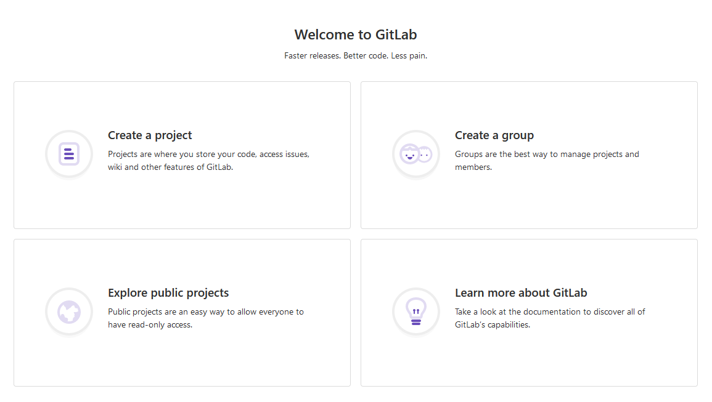
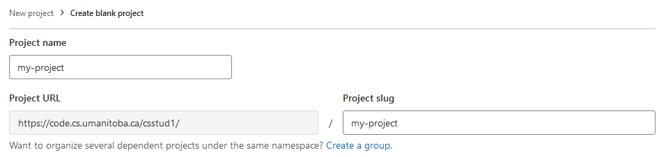
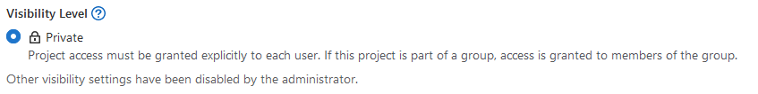
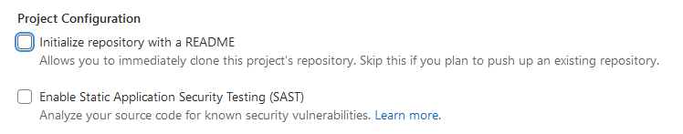
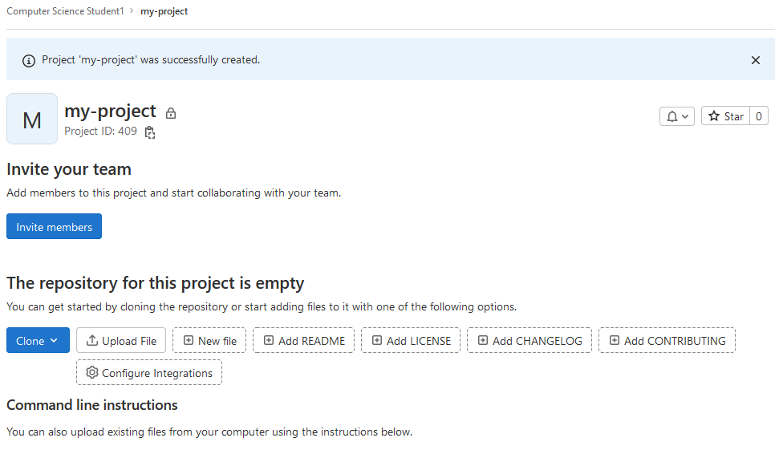

::: outcomes

* [X] Use version control software on your own code to keep track of changes
  that you make over time (initializing and adding changes to a repository).
* [X] Use version control software on your own code to make changes and quickly
  be able to revert to a working state.
* [X] Identify files that should not be version controlled and make sure they
  aren't included in a repository's history (`.gitignore`).

:::

Version control is something that's been around for a long time and different
people have different opinions about how to do version control and which
software should be used for version control. We're going to focus on a specific
version control tool: [`git`].

Version control software helps you keep track of the changes that you've made to
your own code or any kind of file over time. Version control isn't entirely
automatic, you have to tell the software which files to track and when it should
track changes.

[`git`]: https://en.wikipedia.org/wiki/Git

Initializing a repository
=========================

`git` keeps track of things in something called a "repository". In terms of the
things we know about so far in this course, a "repository" is really just a
directory that has some special (hidden) files in it. Repositories can be local
directories, but more often than not repositories are also hosted on a remote
server. When a repository is hosted on a remote server, we're going to refer to
it as a "remote repository".

Let's make our own new remote repository. 

We're going to be doing this not with GitHub, but with a free, open-source, and
self-hostable product called GitLab. The U of M CS Department hosts an instance
of GitLab (there's a web site you can go to that's dedicated for students taking
COMP courses at the U of M) at <https://code.cs.umanitoba.ca>

Open that link, then we're going to go through a few things to create a new
repository.

[stuff `git` needs]: https://git-scm.com/book/en/v2/Git-Internals-Git-Objects


Sign up for GitLab
------------------

Before we can do *anything* with this instance of GitLab, you're going to need
to sign up for a new account. You can skip this step if you've previously signed
up for a GitLab account here.

On [the log in page], click on the "Register now" link, it's just below the big
blue "Sign in" button.

When you sign up, you can enter whatever you want for your "First name", "Last
name", and "Username" (this is not audited by our tech staff), but you **must**
use your `@myumanitoba.ca` e-mail address, no other e-mail addresses are
permitted to sign up.

::: aside

The account you're creating here is not at all connected to your account on
Aviary, you don't (and shouldn't) use the same password for both of these
systems.

This is a real aside: consider starting to use a [password manager] to generate
and securely store your passwords. I can personally recommend [KeePassXC], but
some people like [1password]. Others prefer to manage their passwords on the
command line and can use tools like [pass].

Main advice: don't use the same password for everything; don't write your
password on your hand.

[pass]: https://www.passwordstore.org/
[1password]: https://1password.com/
[KeePassXC]: https://keepassxc.org/
[password manager]: https://en.wikipedia.org/wiki/Password_manager

:::

Congrats! You just signed up for a version control repository service! :tada:

[the log in page]: https://code.cs.umanitoba.ca/users/sign_in

Create a new repository
-----------------------

Now we get to the part that we're really interested in: actually creating a
remote repository to upload our code to.

Just after you finish creating your account, and each time you log in to GitLab,
you're going to be at [your dashboard].



Click on "Create a project". There are several options you can choose from to
create a project, but for now you should click on "Create blank project".

Now you get to be creative by picking a project name. The project name that you
enter here will become part of the project's URL (the address or location of the
repository). If you want to start putting your course documents into this
repository (like you might in an assignment), you should pick something like a
course name (e.g., `COMP1002`).



::: aside

Kind of like when you were [organizing your files], creating a repository has
some amount of decision making in terms of what you're planning to put *into* a
repository.

When building software we usually just make one repository for one application,
but some organizations use [different strategies]. A good general strategy might
be "one repository for one piece of work".

For the purposes of this book and course, I would recommend that you make one
repository per *course* (e.g., make a repository for COMP 1002, make a separate
repository for COMP 2280, make a separate repository for COMP 4820, etc).

Other options that you might consider (for coursework or in general) are a
repository for each:

* Assignment,
* Code library,
* Project,
* Publication.

[organizing your files]: ../topic01/topic-5.html
[different strategies]: https://en.wikipedia.org/wiki/Monorepo

:::

The only option you have for visibility is "Private", and you should leave it
that way.



::: aside

Some repository hosting software (like GitHub) provide the (default) option to
have public repositories. While public repositories are important, in
circumstances where you're planning to put your course documents into the
repository (which you should be!), you don't want to risk having your course
documents being publicly available and accessible. In short: avoid academic
misconduct situations by keeping your repository private.

:::

You'll also see some options for project configuration. You should **deselect
everything** for your first repository. It's not going to hurt to have a
default `README.md` added to your repository, but we're ultimately going to
change what this `README.md` says.



Finally, click the "Create project" button. If everything's worked out, you
should see a new (and empty) project page:



You just created a new remote repository! :tada:

[your dashboard]: https://code.cs.umanitoba.ca/dashboard/projects

Now that we've got an empty repository, we want to start adding files to it.

Cloning a repository
=====================

To be able to add files to our repository, we're going to need to get the
repository into a spot where we can use it. You should do this on Aviary, but
you *can* do this on your local machine.  If you are doing this on your local
machine, you will need to [install `git`].

[install `git`]: https://git-scm.com/downloads

[Open your terminal] and [connect to Aviary :bird:].

[Open your terminal]: ../topic01/topic-2.html#verifying-that-pandoc-is-installed
[connect to Aviary :bird:]: ../topic02/topic-1.html

The main way that we get a remote repository onto our own machines is to "clone"
the repository. We only need one piece of information to clone a remote
repository: the address of the repository.

You can find the address of your repository in two places:

1. The address bar of your browser, or
2. By clicking on the blue "Code" button on the repository page.

Once you know the address of the repository, you will use `git` on the command
line to get your repository onto Aviary; specifically you will use the command

```bash
git clone
```

::: example

I (me, Franklin) created a new repository with the name `hello-world`. The
address bar in my browser has the address:

    https://code.cs.umanitoba.ca/fbristow/hello-world

To get this repository into my user directory on Aviary, I would run the
following:

::: input

```bash
git clone https://code.cs.umanitoba.ca/fbristow/hello-world
```

:::

::: output

```
Cloning into 'hello-world'...
Username for 'https://code.cs.umanitoba.ca': 
```

The remote server is now asking me to enter my username and password. You should
use the username and password that you used to create your account on GitLab.

Once you've entered your username and password, `git` will clone your
repository:

::: output

```
remote: Enumerating objects: 5, done.
remote: Counting objects: 100% (5/5), done.
remote: Compressing objects: 100% (4/4), done.
remote: Total 5 (delta 0), reused 0 (delta 0), pack-reused 0 (from 0)
Receving objects: 100% (5/5), done.
```

:::

Now if you check out what's in your directory, you should see a new folder:

:::::: columns
::: {.column .input width=50%}

```bash
ls
```

:::
::: {.column .output width=50%}

```
comp1002 bin hello-world
```

:::
::::::

:::

:::

:tada:, you've just cloned the remote repository to your local user directory.
Now you should change directory into that repository!

Adding files to a repository
============================

Version control software generally requires that you tell it specifically which
files you want it to keep track of. That means that Git isn't going to keep
track of files that just happen to be in the same directory as the repository,
you have to tell Git to actually keep track of those files.


Create some new files in the repository:

* Make a new plain text file with some text in it using a command-line text
  editor like `vim`. Name the file `README.md`.
* Transfer a file from your computer to Aviary into this directory.
* Copy the `hello` folder from wherever it is to this directory. 

  ::: aside

   You can copy files from one place to another on the same computer using the
   `cp` command. You can copy entire folders from one place to another using the
   `-r` option for recursive (just like `scp`!).

   To copy the `hello` folder here, you can use `cp` from this directory:

   ```bash
   cp -r ../hello . # if hello is in the parent directory
   ```

  :::

Even though we put these files into this directory with the repository, Git
still doesn't know anything about them. We have to add these files to the
repository in two steps:

1. "Staging" the changes by adding them with the `add` subcommand, and
2. Committing the changes using the `commit` subcommand.

"Staging" changes
-----------------

Adding files to the repository is straightforward: you use `git add` and then
tell Git which files should be added to the repository.

Files that you add with `git add` are "staged" --- Git knows that the files
exist and that you want it to track changes to these files, but Git isn't
actually ready to track the changes.

::: example

You can add files and changes to the repository one at a time using `git add`
and including the name of the file that you want to add:

```bash
git add README.md
```

You can also add entire folders to the repository:

```bash
git add hello
```

You can also add *everything in the current working directory* to the
repository:

```bash
git add .
```

:::

Git doesn't tell you anything when you add files or changes to be staged, but
you can ask Git to tell you about the current state it's in by using the
`status` subcommand.

::: example

You can find out which files or changes are staged to be committed using `git
status`:

:::::: columns
::: {.column .input width=50%}

```bash
git status
```

:::
::: {.column .output width=50%}

```
On branch main

No commits yet

Changes to be committed:
  (use "git rm --cached <file>..." to unstage)
          new file:   README.md
```

:::
::::::

Git helpfully tells you how to *unstage* a file if you accidentally added a file
or change you didn't want to add to the repository.

:::

Committing changes to the repository
------------------------------------

Even though Git knows about the files or changes that you've staged, you haven't
told git that you *really* want it to track changes to those files.

A "commit" is what Git really manages: what a specific set of files looked like
at a specific point in time.

When you make a commit to a repository, you're telling your version control
software that the changes that you've made to these files are important and it
should keep track of that. Some important times where you would want to keep
track of things:

* The first time you create a repository and you're adding some files to it.
* When the thing you're working on *works*.
* When you've finished working on a small part of a bigger project.

When you make a commit to a repository, you have to include a "commit message":
a brief, human-readable message describing what you're committing to the
repository.

We can commit staged changes to our repository using the `commit` subcommand.

::: aside

Unfortunately, we've got to do some one-time set up before we can make our first
commit. It's OK If you skip this step (you can fix it later), but things will
flow more smoothly if you do it now.

Before we can make a commit, we need to tell `git` who we are. We can configure
`git` and tell it who we are with the `git config` command:

```bash
git config --global user.name "Your name"
git config --global user.email you@myumanitoba.ca # you should use your own
                                                  # e-mail address here.
```

You only need to do this once per physical computer that you're using `git` on.
In other words: if you're using two computers, you'll need to run this set up
step on each computer, but you only need to do it once.

:::

::: example

We can commit staged changes to a repository using `git commit` and either
writing a commit message in the command itself, or writing a longer commit
message in your text editor.

:::::: columns
::: {.column .input width=50%}

```bash
# commit with a message inline
git commit -m "Initial commit"
```

:::
::: {.column .output width=50%}

```
[main (root-commit) acff39c] Initial commit
 1 file changed, 10 insertions(+), 0 deletions(-)
 create mode 100644 README.md
```

:::
::::::

Your commit is going to look different from mine because you added more files
than me to your commit and you used a different commit message.

You can write a longer commit message by leaving out the `-m` part, and this
will ask Git to open up your text editor where you can write a longer message.

```bash
git commit # opens your text editor to write a message
```

:::

After you commit your changes to the repository, everything still looks pretty
normal. Your files are all still there. Great :tada:!

You can ask Git to tell you what its status is again with `git status`, but this
time it's just going to say that there is nothing to commit

:::::: columns
::: {.column .input width=50%}

```bash
git status
```

:::
::: {.column .output width=50%}

```
On branch main
nothing to commit, working tree clean
```

:::
::::::

::: aside

Git commit messages are important metadata (data about your data) that help you
(or others) better understand the changes that you've made to your files over
time. They're a lot like writing comments in code in the sense that they
shouldn't describe the files that you changed or even describe how you changed
the files, but should describe why you changed the files and what the ultimate
side-effect is ("I fixed this bug!").

Lots of people have opinions on Git commit messages:

* Tim Pope writes about them in [A Note About Git Commit Messages].
* Chris Beams writes about them in [How to Write a Git Commit Message].
* Randall Munroe visualizes them in [Git Commit].

[A Note About Git Commit Messages]:
https://tbaggery.com/2008/04/19/a-note-about-git-commit-messages.html
[How to Write a Git Commit Message]: https://cbea.ms/git-commit/
[Git Commit]: https://xkcd.com/1296/

:::

Adding changes and committing them to your repository is something that you
should be doing not just when you initialize the repository, but frequently as
you're doing your work. You should add any changes to your repository each time
you accomplish something (a new method is working, a bug has been fixed, a
feature is complete).

Reverting changes
=================

Initializing our repository and adding and committing files and changes to our
repository is great, but just adding stuff to the repository isn't exactly
useful.

One important use for version control is being able to go back in time to
changes that were previously committed to the repository.

Let's make some changes to our file. We don't actually care what the changes are
because we're making these changes to be able to see how to *undo* changes.

We can revert uncommitted changes to a file using the `restore` subcommand in
Git.

::: example

Mess up your `README.md`. Go ahead. Have fun!

Here are some things you can do:

* Open it in your text editor and start typing.
* "Accidentally" copy a file and replace `README.md` with that file

  ```bash
  cp hello/compiled/hello.c README.md
  ```
* Remove your `README.md`

  ```bash
  rm -f README.md # LIVE DANGEROUSLY
  ```

Once you've made changes to your file, you can ask Git to tell you about the
status of the file (with `git status`). Depending on what you did, Git will tell
you different things, but it will importantly *notice that something has
changed*. Git will also helpfully give you a hint about how to get your files
back to the state they were in before.

Now revert the changes you made to your `README.md` with the `restore` subcommand

```bash
git restore README.md
```

Now open up your `README.md` again, and it's back to the way it was before you
made the changes!

:::

Files that *shouldn't* be version controlled
============================================

Being able to keep track of changes to our important files is great, but there
are some files that will have changes that *don't* care about.

Some examples of files that will change as you change your own files:

* The `.class` files that get generated when you compile Java programs.
* The `.docx` and `.pdf` files that you generate when converting from Markdown to
  those formats.
* Output files that get generated when you run certain programs.

The common identifying property of all of these files is that they are files
that get *generated* or *created* by something else from the file that you want
to keep track of (`.class` files are generated from the `.java` files you care
about; `.docx` in this case is generated from the `.md` files that you care
about).

We don't usually want to include these files in a version control repository for
a couple of reasons:

1. We can really quickly re-generate them from the files that we're working
   from (it's pretty easy to run `pandoc` again!).
2. Sometimes these files can be **really** big in terms of file size.
3. They are extra changes in our version control history that we *don't care
   about*.

We can tell Git to ignore certain files when they change by created a special
file named [`.gitignore`] in our repository.

::: example

Use your text editor to create a new file named `.gitignore` in the same folder
as your repository.

Each line in a `.gitignore` file is either a comment (lines beginning with `#`)
or describes specific filenames or "patterns" of filenames to be ignored.

Here's an example of what a `.gitignore` file might look like:

```ini
# Ignore README.docx (a specific filename)
README.docx

# Ignore all .class files (a "pattern", any file that ends with .class)
*.class

# Ignore the entire build directory
build/
```  

:::

The `.gitignore` file *is* a file you want Git to keep track of, so you need to
add this file to your repository (use `git add`).

::: aside

Just like the `.git` folder, the `.gitignore` file is "hidden", it doesn't show
up when you try to look at the contents of a directory using commands like `ls`.
This is true in general: any file that begins with a period (`.`) is considered
to be "hidden" on Linux and macOS, but you can see those files by telling a
command like `ls` to list everything (`ls -a`).

:::

[`.gitignore`]: https://git-scm.com/docs/gitignore

Pushing to the remote repository
================================

Now that you've made your repository and added files to it, we want to push all the commits that
you've made (and thus all the files) to the remote repository. Pushing to the
remote repository is something that you should do often, our goal is to make
sure that the local repository you have is approximately synchronized with the
remote repository on the server.

You can push all commits to the remote repository using the `git push`
subcommand:

::: example

You really just need to run:

```bash
git push
```

after you've made some commits.

Just like when you initially cloned the repository, `git` is going to ask you to enter
a username and password. The username and password that you enter here are the
ones that you chose when you signed up for your GitLab account at
<https://code.cs.umanitoba.ca>.

You might see output similar to the following:

::: input

```bash
git push
```

:::

::: output

```
Username for 'https://code.cs.umanitoba.ca': you@myumanitoba.ca
Password for 'https://you@mumanitoba.ca@code.cs.umanitoba.ca':
Enumerating objects: 3, done.
Counting objects: 100% (3/3), done.
Writing objects: 100% (3/3), 225 bytes | 225.00 KiB/s, done.
Total 3 (delta 0), reused 0 (delta 0), pack-reused 0
To https://code.cs.umanitoba.ca/you/comp-1002.git
 * [new branch]      main -> main
Branch 'main' set up to track remote branch 'main' from 'origin'. 
```

:::

Now refresh your browser window that has the remote repository, and you should see some files! :tada:

:::

Further reading
===============

This document gets you started with version control and Git, but you're
definitely going to run into situations where you want to do things that are
more complex than what we've seen here, or you're going to make a mistake and
need to fix it.

You can find lots of good information online about Git and version control, but
here are some resources that are particularly good or helpful:

* Roger Dudler's [git - the simple guide] does a great job of quickly
  summarizing the tasks you might need to do when doing version control with
  Git.
* Seth Robertson's [On undoing, fixing, or removing commits in git] is a "choose
  your own adventure"-style guide on ... well, undoing, fixing, or removing
  commits in Git! Maybe you accidentally committed a file that you don't want to
  be in your repository, or maybe you accidentally forgot to include a file in a
  commit that *should* have been included in that commit. This will guide you
  through getting into the state that you want to be in.
* If you're OK with some profane language in English, Katie Sylor-Miller's [Oh
  Sh\*t, git!?!] is also an excellent source of solutions to "Please help me!"
  moments that you will *definitely* encounter when you're using `git`.

  ::: aside

  Yeah. I know you can swear on the internet. But I have children. One of my
  children can read and the other is *learning* to read, and they will both
  eventually be able to figure out what sh\*t means (and I'm OK with that), I
  still feel some parental sense of responsibility to keep it clean.

  :::

[git - the simple guide]: https://rogerdudler.github.io/git-guide/
[On undoing, fixing, or removing commits in git]: https://sethrobertson.github.io/GitFixUm/fixup.html
[Oh Sh\*t, git!?!]: https://ohshitgit.com/
