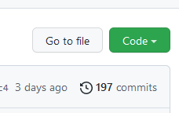
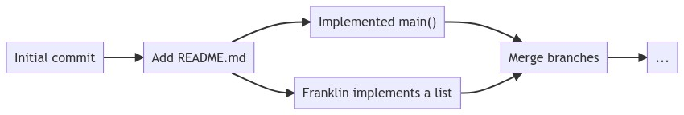

::: outcomes

* [X] Use branching and merging with a version control repository.
* [X] Synchronize repositories between computers for a personal project (e.g.,
  `git push` and `git pull`).

:::

Cloning an existing repository
==============================

We're not the first people to initialize repositories and use version control.
In fact, vast online repositories of different projects exist on sites like
[GitHub], [GitLab], [SourceHut], and more.

Cloning an existing repository from a website is straightforward using the `git
clone` subcommand, just like it was when you cloned your own repository. The
difference now is that we're going to start cloning repositories from out in the
wild :national_park:.

::: example

Let's clone a specific repository. The specific repository contains the source
code that you previously downloaded on the command-line (the hello project).

Start by [opening your terminal] and [connecting to Aviary], then run:

[opening your terminal]:
../topic01/topic-2.html#verifying-that-pandoc-is-installed
[connecting to Aviary]: ../topic02/topic-1.html

::: input

```bash
git clone https://code.cs.umanitoba.ca/cs-lab-course/hello
```

:::

`git` is going to start connecting to a remote web server that's hosting some
source code in a `git` repository, and you should see output that looks similar
to the following (just like you saw when you cloned your own repository):

::: output

```
Cloning into 'hello'...
remote: Enumerating objects: 8, done.
remote: Counting objects: 100% (8/8), done.
remote: Compressing objects: 100% (4/4), done.
remote: Total 8 (delta 0), reused 0 (delta 0), pack-reused 0
Receiving objects: 100% (8/8), done.
```

:::

There's a lot of output here that (honestly) isn't that important in terms of
being able to use `git` for tracking changes to your files.

Just like when you created and cloned your own `git` repository, the folder
`hello` now contains another repository. This repository contains the code that
you downloaded as a `zip` file!

:::

[GitHub]: https://github.com/
[GitLab]: https://about.gitlab.com/
[SourceHut]: https://sr.ht/

Finding a repository's address
------------------------------

Similar to connecting to a remote computer, we have to tell `git` where to find
the repository by giving it an address or location. In the example above, I
provided you with the complete command to clone the repository, but sometimes
you'll find a repository that you're interested in cloning (including your
own!).

::: example

[Standard Ebooks] is a web site that's curated and published many free,
high quality public domain e-books.

The team at Standard Ebooks use GitHub extensively to collaborate and track
changes to the files that are used in the creation of their e-books. You can
find a collection of their repositories on GitHub here:
<https://github.com/standardebooks>

Scroll down a little bit to the "Repositories" section and pick an e-book. The
titles (unfortunately) are pretty messy here, but they are readable (if you
can't pick an e-book, I'll pick one for you: [The Life and Adventures of Robinson Crusoe]).

Once you click on a link to an e-book, you'll be taken to the main page on
GitHub for that repository. The main table in the center of the page is a
listing of the files and folders that are in that repository. Just above and to
the right of that table is a green button labelled "Code":



Click the green "Code" button, then you can copy the text under "HTTPS", this is
the address of the repository that you're going to use to tell `git` where it
should look when it's cloning the repository.


Now you can paste this link into your terminal as part of a `git clone` command:

```bash
git clone git@github.com:standardebooks/daniel-defoe_the-life-and-adventures-of-robinson-crusoe.git
```

Now you've cloned a repository made by someone else! :tada:

[Standard Ebooks]: https://standardebooks.org/
[The Life and Adventures of Robinson Crusoe]:
https://github.com/standardebooks/daniel-defoe_the-life-and-adventures-of-robinson-crusoe

:::

Branches
========

So far we've been using the basic features of Git to track changes to files that
we have in a repository. We can visualize these changes as a linear list:


We can literally see this if we use the `git log` subcommand, and we can also
get back to previous commits using the `git checkout` subcommand.

::: example

Take a look at the commit history from one of your own repositories:

::: input

```bash
git log
```

:::

::: output

```
commit 3d7739db044efa992bbfdb2d613a0fc025f39d71 (HEAD -> main, origin/main)
Author: Franklin Bristow <fbristow@cs.umanitoba.ca>
Date:   Mon Sep 26 14:07:53 2022 -0500

    Updating TODO.

commit 943ae855084a66fbdee8b7469f81be284e04cf65
Author: Franklin Bristow <fbristow@cs.umanitoba.ca>
Date:   Mon Sep 26 13:58:54 2022 -0500

   Writing more about version control.
    
   Looking back at log messages is cool, so let's use `git log` to see them. 
```

:::

Those long numbers that you see after the word "commit" are unique identifiers
for that commit. You can get back to the state that your project was in at that
state by using the `git checkout` command:

::: input

```bash
git checkout 3d7739
```

:::

You can either copy and paste the complete commit ID, or you can use the first 7
or 8 characters. 

When you run that command (with the appropriate commit ID!), `git` will print
out some information about what you can do, including how to get back to the
`main` branch.

You can quickly get back to the "head" (the last commit that you
made) using the `git switch` command:

::: input

```bash
git switch main
```

:::

:::

This is good enough for the most part, but there's more to Git than just keeping
track of a linear sequence of changes over time. One of the most powerful
concepts behind Git is that it can actually keep track of an entire [*graph*] of
changes over time, possibly coming from many authors and contributors.

[*graph*]: https://en.wikipedia.org/wiki/Graph_(discrete_mathematics)

We're going to take a look at a feature in Git called "branches". Branches are
something that we can use to track multiple independent sequences of commits to
a repository simultaneously. When a repository has multiple branches, its commit
history can look something like this:



Branches are very useful when you're working in a team of people, who are each
independently working on (for example) a feature in a bigger project. All of
these people will want to independently make changes and commits, but not
interfere with each other's work until they're finished.

::: aside

You will almost certainly not use branches on projects that you're working on by
yourself. You *might*, and you're more than welcome to use them, but don't worry
too much about forcing this into your version control workflow.

Because of that, we're going to be looking mostly at the mechanical "How do I
make a branch, and how do I merge a branch back into the `main` branch?" instead
of the philosophy of best practices with branches.

:::

Creating a new branch
---------------------

You can create a new branch in your `git` repository using the `git branch`
subcommand.

::: example

From anywhere inside your `git` repository, you can run `git branch` to create a
new branch in your repository:

```bash
git branch my-new-branch
```

Typically when you make a new branch, the name of the branch should represent
something about what you're intending to work on in that branch (e.g.,
"new-feature").

:::

Listing and switching branches
------------------------------

We just created a branch (:tada:), but... that's not very useful in and of
itself. We want to be able to see which branches are currently in a repository,
and we want to be able to *switch* to that branch so that we can track
changes. We're going to use the `git branch` and `git switch` commands.

::: example

We can ask `git` to tell us which branches are in a repository by using the `git
branch` subcommand without specifying a branch name:

:::::: columns
::: {.column .input width=50%}

```bash
git branch
```

:::
::: {.column .output width=50%}

```
* main
  my-new-branch
```

:::
::::::

We can ask `git` to switch us to that branch using the `git switch` subcommand:

:::::: columns
::: {.column .input width=50%}

```bash
git switch my-new-branch
git branch
```

:::
::: {.column .output width=50%}

```
  main
* my-new-branch
```

:::
::::::

:::

Once we're on this new branch, we can use `git` the same way that we were
before, `add`ing and `commit`ing changes, then switch back to our `main` branch
using `git switch`.

Try creating several branches, make changes, stage (add), then commit those
changes, then switch between branches to get an sense of how commits apply to
branches.

Pushing branches to remote
--------------------------

You can also push branches that you have in your local repository to the remote
repository. You actually already did this the first time you pushed to a remote
repository with your `main` branch when you did `git push -u origin main`. You
can also push local branches to remote with `git push`:

::: example

To push the new `my-new-branch` to the remote repository, we would use the
`push` subcommand with the `-u origin` option:

::: input

```bash
git push -u origin my-new-branch
```

:::

:::

Merging branches
----------------

OK great! Now we have one repository that has several different commit
histories. If you want to think in terms of data structures (and maybe you don't
want to think in terms of data structures), we've effectively built a tree
:evergreen_tree: of commit histories.

Having these multiple, independent commit histories is fine, but if we're
working on a project with multiple people, and those multiple people each have
their own branch, we need to be able to take all the work that they've
independently done and put it back into the `main` branch so that we have a
single project that has *all* the commits and features.

To do this, we're going to have to "merge" the branches back together; take all
the commits from one branch, and put them into another branch. We're going to
use the `git merge` subcommand to do this.

::: example

Start by listing the branches that you have in your repository with `git
branch`:

:::::: columns
::: {.column .input width=50%}

```bash
git branch
```

:::
::: {.column .output width=50%}

```
  main
  my-new-branch
* another-branch
```
:::
::::::

You can merge multiple branches together by switching to the "target" branch
(usually `main`), then running `git merge` with the name of the branch that you
want to bring into that branch.

::: input

```bash
git switch main # switch back to the main branch
git merge my-new-branch
```
:::

If everything goes smoothly, `git` will tell you about what it's done to your
file by telling you how many files were changes, how many "insertions" it made
(additions to your files) and how many "deletions" it made (lines or changes
that removed content):

::: output

```
Updating 8e7c6d6..ca7accf
Fast-forward
 updated-file | 3 +--
 1 file changed, 1 insertion(+), 2 deletion(-)
```

:::

:::

#### Merge conflicts

[Things may not go smoothly]. When two people are working independently on two
different, independent histories within a single repository, they may need to
make changes to the same file. `git` does a pretty good job of automatically
"merging" multiple changes to the same file, but sometimes it can't and you'll
get a "merge conflict".

::: example

Let's start again with a different branch, switch to `main`, then `merge`
changes again:

::: input

```bash
git switch main # switch back to the main branch
git merge my-other-new-branch
```

:::

When things don't go the way you expected, `git` is going to report that it
couldn't automatically merge your changes:

::: output

```
Auto-merging updated-file
CONFLICT (content): Merge conflict in updated-file
Automatic merge failed; fix conflicts and then commit the result.
```

:::

Git tried it's best (it really did!), but it couldn't figure out how it should
merge the changes from the different histories. When Git can't merge changes,
it's in a state where you either must abandon the merge, or help Git figure out
the correct way to merge things. If you just want to bail out (give up on
merging and get back to a good state in `main`), you can use the `--abort`
option:

::: input

```bash
git merge --abort
```

:::

At that point, you're back to the last commit you had on the `main` branch.

You probably want to help Git with the merge, though. The way you help Git with
the merge is to open the file that's listed in the conflict and take a look. The
file's contents are going to look something like:

::: output

```
<<<<<<< HEAD
the content that's in the main branch
=======
the content that's in the branch you were trying to merge
>>>>>>> my-other-new-branch
```

:::

Git is highlighting the change that it couldn't merge. Your job to help Git is
to replace this entire block (everything between `<<<<<<` and `>>>>>>`) with
what is the correct way to "merge" this. The "correct" way to merge this, of
course, depends on the files that you're tracking the history of. If you're
tracking Java files, for example, you'll have to figure out and then write
whatever the actually correct and compilable version of code should be for this
section.

Once you've done that and you're satisfied with the changes, you should `add`
the changes that you made, then `commit`:

::: input

```bash
git add .
git commit -m "Merge with my-other-new-branch"
```

:::

:tada:! You just resolved a merge conflict!

:::

[Things may not go smoothly]: https://www.youtube.com/watch?v=yJxCdh1Ps48

Synchronizing projects between computers
========================================

Doing `scp` is, honestly, a little tedious. Even using graphical tools is pretty
tedious.

One way (among many!) that you can keep your folders synchronized between two
different computers is to use a remote `git` repository, cloning and pulling on
the "secondary" computer (Aviary in this case).

You've already got your repository on Aviary, so let's clone the repository onto
your own personal computer.

Install Git
-----------

Git is originally a command-line tool (how you've been using it). You can
install `git` on all of Windows, macOS, and Linux. How you install it depends on
which of those that you're using.

<details><summary>Installing Git on macOS</summary>

You can install Git in several ways on macOS, but probably the most
straightforward way is to install [Xcode]. This honestly feels a bit like
[overkill]; we're installing an entire programming environment and multiple
programming language compilers just to get Git, but it really is the most
straightforward way to get Git. The easiest way to install Xcode is from the
[Mac App Store].

If you're feeling adventurous, you can take an alternative approach and install
[Homebrew]. If you take this approach, I'll give you a link to the [macOS
install page on Git's website], but you're otherwise on your own.

[Xcode]: https://developer.apple.com/xcode/
[overkill]: https://en.wikipedia.org/wiki/Overkill_(term)
[Mac App Store]: https://apps.apple.com/us/app/xcode/id497799835?mt=12
[Homebrew]: https://brew.sh/
[macOS install page on Git's website]: https://git-scm.com/download/mac

</details>

<details><summary>Installing Git on Windows</summary>

You can install Git for Windows by downloading the installer on [Git's "Download
for Windows" page]. You almost certainly want to download the **Standalone
Installer**, and you almost certainly want to download the "64-bit Git for
Windows Setup". Download the installer, launch it, and follow the instructions
on-screen. You should be able to accept all default options in the install
process.

If you're feeling adventurous, you can take an alternative approach and install
either [winget] or [Chocolatey] and install Git using a package manager. If you
choose to take this approach, you're on your own.

[Git's "Download for Windows" page]: https://git-scm.com/download/win
[winget]: https://learn.microsoft.com/en-us/windows/package-manager/winget/
[Chocolatey]: https://chocolatey.org/

</details>

<details><summary>Installing Git on Linux</summary>

The best way to install Git on your Linux machine is from the command line,
using your package manager. We're not going to talk much about package managers
(yet), but [Git's "Download for Linux and Unix" page] lists the exact command
that you need to run for most popular Linux distributions. Find yours and run
it.

You do need to run these commands as the `root` user. If you've used `sudo`
before, this is what you should use to run these commands. If you're not sure
what to do here, you should ask for help.

[Git's "Download for Linux and Unix" page]: https://git-scm.com/download/linux

</details>

Workflow
--------

You can generally keep using `git` the way that you've been using it up until
now: make changes to your files, stage the changes with `add`, then `commit` the
changes to history.

Now you should also `push` to your remote repository occasionally:

::: input

```bash
git push
```

:::

You *don't* need to do `-u origin`.

To get the changes on your other computer, you should use `git pull`:

::: input

```bash
git pull
```

:::

Depending on what you've done with your repositories, you may get merge
conflicts when you pull (if you edited a file on your local computer *and* on
Aviary). You can deal with merge conflicts as described above.

Further reading
===============

This is **a lot**.

Git is an incredibly big tool with lots of ways to use it, and we couldn't
possibly look at every possible way to use it.

Instead, here are some additional resources for using Git that you can check
out:

* The [Documentation page] on Git's homepage. This actually has several
  sub-resources that you should check out: a complete reference manual for Git,
  "Pro Git" (a book), and a series of videos introducing basic Git.
* [Learn GitLab with tutorials] is a pretty comprehensive overview of **GitLab**
  itself. There's a lot about Git in this set of tutorials, but the target for
  these tutorials is specifically how to use GitLab. Some of the skills that you
  learn here would be transferable to something like GitHub.
* [Learn Enough Git to be Dangerous] is a good resource for version control
  basics. Part of it is free, but it isn't entirely free.
* [GitHub Skills] is a suite of resources similar to "Learn GitLab with
  tutorials", but targeting GitHub specifically.
* [Oh My Git!] is a game to help learning how to use Git and its concepts.

[Documentation page]: https://git-scm.com/doc
[Learn GitLab with tutorials]: https://docs.gitlab.com/ee/tutorials/
[Learn Enough Git to be Dangerous]: https://www.learnenough.com/git-tutorial
[GitHub Skills]: https://skills.github.com/
[Oh My Git!]: https://ohmygit.org/
