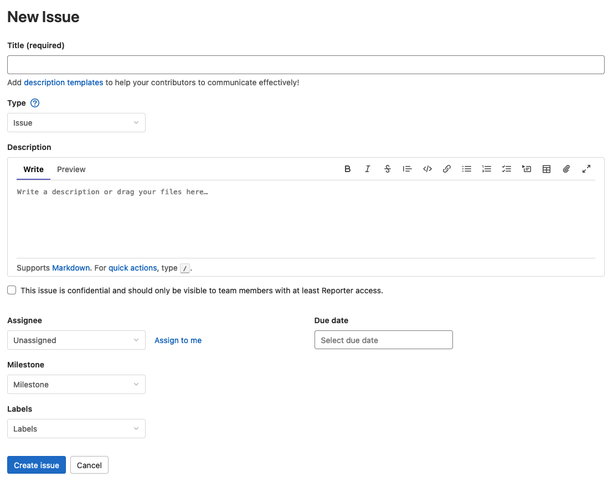
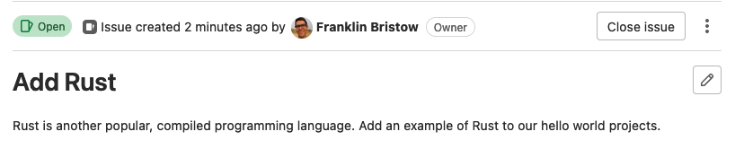

::: outcomes

* [X] Manage personal project tasks as issues using web-based issue tracking
  software.

:::

Issue tracking
==============

One helpful feature that's included in most online version control repositories
(like GitHub or GitLab) are "issue trackers". Every remote repository that you
create in GitHub or GitLab has an issue tracker built in. You can find the issue
tracker for your remote repository on GitLab on the left side of the page in
your project:

Click on "Issues" or click on the "List" that pops up, and this will take you to
the main page for working with issues in your repository.

::: aside

The original purpose for "issue trackers" was for users of open source projects
to report bugs to the developers, and for them to communicate with each other
about the problem.

Over time issue tracking with projects has also become a planning tool for
thinking about what needs to be done to put a project together, both in terms of
"let's break this big problem into smaller, actionable tasks", but also "this
task is going to get assigned to this person".

:::

Creating a new issue
====================

Creating new issues is pretty easy: click on the "New issue" button! On the page
you're taken to, you can enter a title (a *very* short summary of what you're
doing), you can choose a type (you always want to choose "Issue"), and you can
write a description (a **long** description of what the problem is, or what you
need to do; this is **Markdown**!).

You can also do things like assign the issue to someone (it's you in this
case!), select a due date (when you want to finish this by), or add "milestones"
(major points or dates in the project) or labels (extra information that
classifies the issue, but doesn't fit in to the title, type, or description).

Coming up with issues
=====================

Mechanically creating issues is indeed pretty easy. Deciding what issues or
tasks you want to actually have... isn't quite as easy.

There's unfortunately no special formula for how you come up with tasks, but
here are some examples of what you could use as a basis for creating new issues
in your remote repositories:

* For programming assignments in class, you could pick something like smaller
  parts of the assignment. If you know you need to create a linked list, for
  example, you could make an issue about linked lists. Basically: try to use
  smaller parts of the overall task that you need to do for the assignment as
  issues.
* For non-programming assignments in class, you can approach this in a similar
  way: identify smaller parts of things you need to do, and create issues for
  those.
* For group programming assignments and projects, think about using this as a
  way to assign smaller tasks to individuals in the project.

One alternative way you can think about issue tracking is like a TODO list, but
with a nice web interface.

Closing issues
==============

Just creating issues is... not a healthy way to live your life.

As you finish issues, you can close them either by writing [specially formatted
commit messages in your Git commits] or manually by clicking on the "Close
issue" button at the top of the issue page:

[specially formatted commit messages in your Git commits]:
https://docs.gitlab.com/ee/user/project/issues/managing_issues.html#closing-issues-automatically
