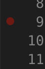
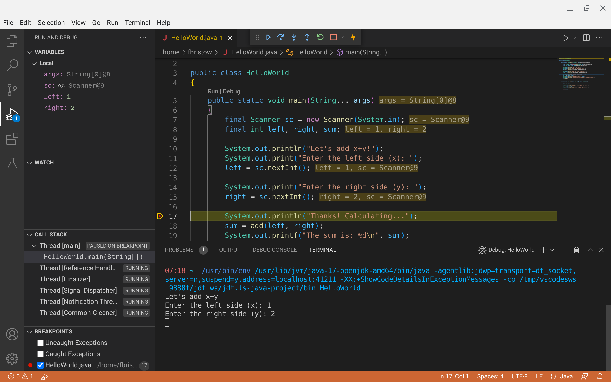

Almost all languages have a visual debugger built into the integrated
development environment (IDE) that you use for that language: [IntelliJ] has a
debugger for Java, [Visual Studio] has a debugger for C# (and other languages),
[Spyder] has a debugger for Python.

While we can't comprehensively cover all different visual debuggers, most of the
skills you're going to learn about the debugger you're using will transfer to
other visual debuggers.

We're going to be using a visual debugger for Java that comes as an extension
for Visual Studio Code.

[IntelliJ]: https://www.jetbrains.com/idea/
[Visual Studio]: https://visualstudio.microsoft.com/
[Spyder]: https://www.spyder-ide.org/

Getting started
===============

You've already got VS Code installed on your machine. We're going to be
debugging some Java code and VS Code doesn't have support for Java by default.
Thankfully, though, we can install an extension to help us get support for the
language.

[Microsoft recommends] that you install the [Extension Pack for Java]. The
Extensions Pack for Java page lists install instructions, and you should follow
those instructions.

Once the extension pack has finished installing a "Get Started" document should
open:


If you've never installed a [JDK] (or don't remember if you have, or don't know
if your VS Code is configured to use the JDK), you should install one (or
configure VS Code to find your JDK).

Before doing this check to see if you have a JDK installed by following the
instructions in the "Get Started" document (open a terminal and run `java
-version`). If you get output here that isn't something of the form "Command not
found", then you've already got a JDK installed and configured and you can
safely skip this step.

<details><summary>Installing a JDK in Windows</summary>

Click on the "Install JDK" button. The defaults that VS Code suggests are good
defaults that you can accept: Adoptium's Temurin, version 17 (LTS), and JVM is
hotspot.

Click on the Download button, find the `.msi` file in your Downloads folder, and
follow the on-screen prompts.

After you've finished installing the JDK click on the "Reload Window" button.

You should now be ready to run and debug Java programs!

</details>

<details><summary>Installing a JDK in macOS</summary>

Click on the "Install JDK" button. The defaults that VS Code suggests are good
defaults that you can accept: Adoptium's Temurin, version 17 (LTS), and JVM is
hotspot.

Click on the Download button, find the `.pkg` file in your Downloads folder, and
follow the on-screen prompts.

After you've finished installing the JDK click on the "Reload Window" button.

You should now be ready to run and debug Java programs!

</details>

<details><summary>Installing a JDK in Linux</summary>

The installer that VS Code offers to help you by downloading is... fine, but
it's a pain to configure. I recommend you use your package manager instead. On
Debian or Ubuntu-based distributions you can use `apt`:

```bash
sudo apt install openjdk-17-jdk
```

After the install completes, you may need to click on the "Install JDK" button
in VS Code, then click on the "Reload Window" button.

You should now be ready to run and debug Java programs!

</details>

[JDK]: https://en.wikipedia.org/wiki/Java_Development_Kit
[Extension Pack for Java]: https://marketplace.visualstudio.com/items?itemName=vscjava.vscode-java-pack
[Microsoft recommends]: https://code.visualstudio.com/docs/languages/java#_install-visual-studio-code-for-java

Running Java in VS Code
=======================

Once you're set up, you can start debugging!

Here's a **very small** Java program (you can copy and paste this into a new
file in VS Code, save it as `HelloWorld.java`):

```java
import java.util.Scanner;

public class HelloWorld
{
    public static void main(String... args)
    {
        final Scanner sc = new Scanner(System.in);
        final int left, right, sum;

        System.out.println("Let's add x+y!");
        System.out.print("Enter the left side (x): ");
        left = sc.nextInt();

        System.out.print("Enter the right side (y): ");
        right = sc.nextInt();

        System.out.println("Thanks! Calculating...");
        sum = add(left, right);
        System.out.printf("The sum is: %d\n", sum);
        System.out.println("Thanks for letting me calculate for you!");
        sc.close();
    }

    public static int add(final int left, final int right)
    {
        final int sum;
        
        System.out.println("\tAbout to add left to right.");
        sum = left + right;
        System.out.println("\tHeading back to the caller.");
        
        return sum;
    }
}
```

OK, maybe it's not that small, but it is mostly `println` statements. 

Once you save the file, VS Code may, uh, *think* for a little bit while it
compiles your code and stuff. While VS Code is thinking, you'll see some
indication that it's doing something in the form of a spinner in the bottom
right side of the window.

<figure>
    <video src=progress-trim.webm loop=true autoplay=true></video>
    <figcaption aria-hidden="true">Compiling progress in VS Code.</figcaption>
</figure>

Eventually you'll be able to run the program in VS Code when you see the options
to Run or Debug just above the `main` method:


Click on the Run button for now, just to verify that your environment works
correctly. If your environment is working correctly, the program should start
running in a terminal pane in VS Code.

Debugging in VS Code
====================

Click on the Debug button now:


Suddenly a lot has changed about our window. 

::: aside

... or if you're running macOS, maybe it hasn't. If these new panes didn't show
up, click on the debug button on the left side of the window, it's the button
that looks like a play button with a little bug on in.

:::


On the left side of the window are four new panes:

1. The **Variables** pane, listing variables that are in scope and their current
   value.
2. The **Watch** pane, where you can enter expressions to be evaluated so you
   can see how they change without writing those expressions in your program.
3. The **Call stack** pane, showing information about the methods that have been
   called (this is similar to the stack trace you see when a Java program
   crashes).
4. The **Breakpoints** pane, where you can see a list of places in your program
   that will cause the debugger to pause execution (exceptions) or where you
   have set a breakpoint in your code.

On the top is a new toolbar that has (in this order):

1. A **pause** button to pause your running program.
2. A **step over** button to run a line of code and move to the next one.
3. A **step into** button for when you want to move *into* the method instead of
   running it to completion.
4. A **step out** button for when you want to finish running the method and go
   back to where you were before.
5. A **stop** button to stop your running program.
6. A **hot code replace** button for when you make changes to your code while
   the debugger is running, replacing the running code with the newly saved
   file.

Right now your program is blocked waiting for you to type something in. Type in
some numbers in your terminal and the program will finish running. Other than
briefly changing the layout, debugging hasn't given us any new tools for
learning about the flow and state of our program...

Setting breakpoints
-------------------

One of the main things you'll do with a debugger is set breakpoints. As before,
breakpoints are the places and/or conditions where you want the debugger to stop
running your code so you can *look around*.

:::::: columns
::: {.column width=70%}

You can set a breakpoint in VS Code by moving your mouse to where the line
numbers are, then clicking on the red circle that shows up just to the left of
the line number.

Pick a line in the code where you would like the program to stop when the
debugger is running. I'm going to suggest you set a breakpoint on line 17, just
after the `Scanner`-based input is done.

:::
::: {.column width=30%}



:::
::::::

Once you've set your breakpoint (the red circle should be brighter and stay
there when you move your mouse away), click the Debug button again. You're going
to have to enter the numbers again, but just after you enter the last number
the contents of the panes will now have values, and the line where the program
has paused on will be highlighted:



In the variables pane you can see the names of all variables that are currently
in scope (`args`, the values passed to your program on the command line, `sc`
our `Scanner`, `left`, and `right`; `sum` doesn't show up because it hasn't been
initialized with a value yet). You can also see these values on lines in the
editor area where they are used.

Stepping over
-------------

Click on the **Step over** button. This will run the line that was highlighted,
then move to the next line. If you set your breakpoint on line 17, then the
`System.out.println` was run, and you can see the output in your terminal.

Now the *next* line of code is highlighted (where we call `sum`).

Stepping into
-------------

Let's step into this method, click on the **Step into** button. This changes
the location of the highlighted line to be *in* the `sum` method:


The content of the **Variables** pane has changed, now it's only what's in scope
in the `sum` method (`left` and `right`).

The content of the **Call Stack** pane has also changed. Before the only line
under `Thread (main)` was `HelloWorld.main`, and now that we're running code in
the `sum` method, we've added that to our call stack.

You can click on entries in the call stack to see what things looked like in the
method that got you here. Click on the `HelloWorld.main` entry and you'll be
taken back to the place where we called `sum` in `main`, and you can review the
state of the variables in the **Variables** pane again.

Stepping out 
------------

Click back on `HelloWorld.add` in the **Call Stack** pane. You should be
highlighting line 30 right now.

Click the **Step over** button twice, once to run the `System.out.println` and
another time to run the `sum = left + right`.

Now click on the **Step out** button. Stepping out runs the remaining lines in
the method, then returns you to where you were before.

Finishing
---------

At this point you can click on either the **Pause/Play** button to finish
running the program, or click on the **Stop** button to end the program without
finishing.

Catching crashes
----------------

Debuggers can also help when your code crashes. Disable the breakpoint you set
by clicking on the red circle, then click the Debug button again to restart
debugging.

Just after debugging starts, click the checkboxes in the **Breakpoints** pane to
catch both "Uncaught exceptions" and "Caught exceptions".

Once the code is running, enter something that *isn't* a number and press
<kbd>Enter</kbd>. As soon as you do that, the debugger will pause execution
because an exception was thrown:


We can see in the **Call Stack** pane that `Scanner` is throwing the exception
and that the exception is an `InputMismatchException`. You *may* be able to
click on the stack entries for `Scanner` if you have installed the source code
for the JDK. When this is in a call stack for your own program, you can click on
the methods and see the state your code was in just before the crash happened.

Further reading
===============

These are the basics for using the debugger in VS Code, and there's a lot we
didn't go into. You can read a lot more on the [Running and debugging Java] page
on VS Code's home page.

The ideas we've worked through are present in almost all visual debugging tools.
Here's a short list of IDEs with debuggers that have similar functionality to VS
Code's debugger:

* [Debug Java in IntelliJ IDEA]
* [Debug code in Visual Studio]
* [Debug C/C++ in Visual Studio Code]

[Debug C/C++ in Visual Studio Code]:
https://code.visualstudio.com/docs/cpp/cpp-debug
[Debug code in Visual Studio]:
https://learn.microsoft.com/en-us/visualstudio/debugger/?view=vs-2022
[Debug Java in IntelliJ IDEA]:
https://www.jetbrains.com/help/idea/debugging-code.html
[Running and debugging Java]:
https://code.visualstudio.com/docs/java/java-debugging
