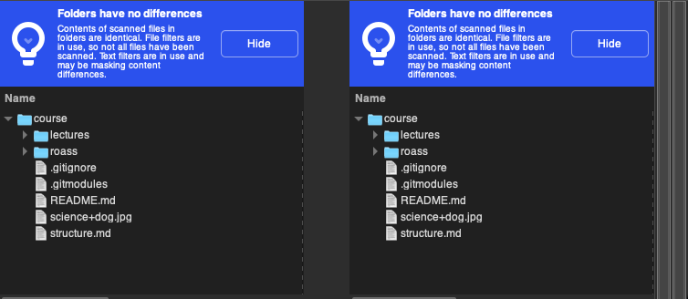

::: outcomes

* [X] Choose an appropriate backup strategy for protecting your files.

:::

)](backups.gif)

The main driving factor in deciding how you're going to be backing up your data
is really the data itself: what the data is, how urgently you need the data back
if it was gone, where you're backing up to, how much you're backing up, how much
you're willing to pay.

Let's look at each of these, then look at some strategies you can use to backup
your files.

Things to consider
==================

What kind of data are you backing up?
-------------------------------------

Not just what kind of data are you backing up, but:

<details><summary>How important is that data?</summary>

* Not very important (I know what this data is, but I don't really care about
  it).
* Somewhat important (This is useful but not *that* important).
* Very important (I would be devastated if I lost this data).

</details>

<details><summary>How replaceable is that data if it were suddenly
gone?</summary>

* Trivially replaceable (I know exactly how to replace it, and I can do it in a
  few minutes).
* Painfully replaceable (I know exactly how to replace it, but it's going to
  take hours or days).
* Irreplaceable (I can't replace this at all).

</details>

<details><summary>How often do you use this data or how urgently do you need it
back if it were gone?</summary>

* Not frequently used and not urgent (you have this data, but you very
  rarely need to open it; when you need to open it, it wouldn't be big deal
  if it were gone).
* Somewhat frequently used or somewhat urgent (you use this data regularly;
  when you need to open it you'd need it back within a day or two if it were
  gone).
* Very frequently used or very urgent (you use this data frequently and you
  need it back within minutes or hours if it were gone).

</details>

Here are some examples of the kinds of data you could consider backing up, and
some answers to the questions above:

+------------------+-----------------+----------------+-------------------------+
| Thing to back up | Importance      | Replaceability | Frequency or urgency    |
+==================+=================+================+=========================+
| Personal photos  | Very important  | Irreplaceable  | Not something you use   |
| and videos       |                 |                | frequently; not urgent  |
|                  |                 |                | to get back when it's   |
|                  |                 |                | missing, it's OK to     |
|                  |                 |                | wait a few days.        |
+------------------+-----------------+----------------+-------------------------+
| Documents and    | Important but   | Painfully      | Something you use       |
| assignments      | less important  | replaceable    | frequently near a due   |
|                  | over time.      |                | date and less           |
|                  |                 |                | frequently after;       |
|                  |                 |                | urgent to get back near |
|                  |                 |                | a due date (minutes or  |
|                  |                 |                | hours), way less        |
|                  |                 |                | urgent after a due      |
|                  |                 |                | date.                   |
+------------------+-----------------+----------------+-------------------------+
| Web browser      | Passwords are   | Irreplaceable  | Something you use       |
| information like | important,      | or painfully   | frequently. Passwords   |
| passwords,       | bookmarks are   | replaceable.   | could be very urgent to |
| bookmarks,       | less important, |                | get back quickly.       |
| history.         | history is not  |                |                         |
|                  | important.      |                |                         |
+------------------+-----------------+----------------+-------------------------+
| Music and        | Not very        | Replaceable    | Maybe something you use |
| videos from      | important.      | from the       | frequently, not that    |
| online.          |                 | source.        | urgent to get back.     |
+------------------+-----------------+----------------+-------------------------+
| Programs         | Important.      | Replaceable.   | Something you use       |
| installed on     |                 |                | frequently. Could       |
| your computer.   |                 |                | be urgent to get back,  |
|                  |                 |                | but not often.          |
+------------------+-----------------+----------------+-------------------------+
| Program          | Not very        | Painfully      | Something you use       |
| configuration.   | important.      | replaceable.   | frequently. Could be    |
|                  |                 |                | urgent to get back, but |
|                  |                 |                | not often.              |
+------------------+-----------------+----------------+-------------------------+
| Your operating   | Not very        | Trivially or   | Something you use       |
| system's         | important.      | painfully      | frequently. Not that    |
| configuration    |                 | replaceable,   | urgent to get back.     |
| (how you've      |                 | depending on   |                         |
| configured       |                 | how much you   |                         |
| keyboard         |                 | have           |                         |
| shortcuts).      |                 | configured.    |                         |
+------------------+-----------------+----------------+-------------------------+
| Your operating   | Important.      | Replaceable.   | Something you use       |
| system.          |                 |                | frequently, pretty      |
|                  |                 |                | urgent to get back, but |
|                  |                 |                | might mean bigger       |
|                  |                 |                | problems if it's        |
|                  |                 |                | missing (failed         |
|                  |                 |                | hardware).              |
+------------------+-----------------+----------------+-------------------------+

Where are you backing up to?
----------------------------

Once you've thought about the data that you want or need to back up, you should
start thinking about where you're going to back up that data.

How important or replaceable your data is and the urgency that you have to get
it back affect the choices you're making here.

If you're backing up multiple different things, you might be backing up those
things to different places.

When you're thinking about where you're backing up to, you should consider a few
things:

* How easy it is to use ("I already do stuff like this all the time" to "I need to
  learn something completely new").
* How expensive it is ("I already have all required equipment or software" to "I
  need to buy new expensive hardware or software").
* How reliable it is ("I still lose everything if my hardware fails" to "my house
  could burn down and I'm still OK").

Here are some examples of where you could back up to:

+-------------------+----------------------+-----------------+------------------+
| Place             | Ease of use          | Cost            | Reliability      |
+===================+======================+=================+==================+
| Another folder    | Very easy, it's      | Very cheap,     | Very unreliable; |
| on your computer. | just copy and paste. | it's just your  | if your hard     |
|                   |                      | computer.       | drive fails,     |
|                   |                      |                 | you lose both    |
|                   |                      |                 | copies.          |
+-------------------+----------------------+-----------------+------------------+
| Another drive in  | Still very easy,     | Kind of         | More reliable,   |
| or attached to    | it's just copy and   | expensive,      | can be made more |
| your computer.    | paste.               | new drives      | reliable if you  |
|                   |                      | aren't cheap.   | move the other   |
|                   |                      |                 | drive to a       |
|                   |                      |                 | different        |
|                   |                      |                 | physical         |
|                   |                      |                 | location.        |
+-------------------+----------------------+-----------------+------------------+
| Other kinds of    | Straightforward to   | Can be          | [CDs and DVDs    |
| physical media    | use, but you might   | expensive; CDs  | are not          |
| (CDs, DVDs,       | need special         | and DVDs are    | long-term        |
| [tapes]).         | software.            | cheap, tape     | reliable]. Tapes |
|                   |                      | drives are not. | are very         |
|                   |                      |                 | reliable.        |
+-------------------+----------------------+-----------------+------------------+
| Online storage    | Straightforward to   | Usually free    | Generally        |
| tools (Dropbox,   | use. You do need     | for small       | reliable, but    |
| OneDrive).        | special software,    | amounts of      | can fail in      |
|                   | but it's usually     | data and not    | unexpected ways. |
|                   | simple to use.       | very expensive  | You're relying   |
|                   |                      | for more.       | on the company   |
|                   |                      |                 | running the      |
|                   |                      |                 | service.         |
+-------------------+----------------------+-----------------+------------------+

[CDs and DVDs are not long-term reliable]:
https://en.wikipedia.org/wiki/Disc_rot
[tapes]: https://en.wikipedia.org/wiki/Tape_drive

How are you actually going to back up your data?
------------------------------------------------

When you've decided where you're backing up to, then you can think about how
you're going to make the back ups. There are two approaches to backing up data
from a computer: 

1. **Image-based (drives or [partitions])**.

   This is making a byte-for-byte copy of your entire disk.

   This is good because you're copying literally everything that's on your
   drive. Ideally this means that you can take a complete image, remove the
   drive from your computer (or move to a different computer), then restore the
   image to the new drive or computer and immediately have an exact copy of the
   whole thing.

   This is bad because it takes a lot of space (you're backing up a lot of stuff
   you don't care about) and because you're effectively treating all the data on
   your drive as the same kind of data (your operating system is not as
   important as your pictures). You also can't trivially extract a single file
   from a drive image (you *can*, but not trivially).
2. **File-based**.

   This is copying just files and folders (and maybe their [metadata]), and
   usually this means that you can open the folder in your file browser and
   actually see the files.

   This is good because you're only taking as much space as you need to back up
   what you're trying to back up, and it means that you can be more [granular]
   about your approach to backing up your files (you can put pictures on tape in
   a safe deposit box and just not back up your downloaded music at all).

   This is bad because you have to intentionally back up what you want to back
   up. You also can't (or shouldn't) back up an entire operating system this
   way.

[partitions]: https://en.wikipedia.org/wiki/Disk_partitioning
[metadata]: https://en.wikipedia.org/wiki/Metadata
[granular]: https://en.wikipedia.org/wiki/Granularity

Software
========

Let's look at a few examples of software for backing up your files and evaluate
them.

Copy and paste
--------------

This is... copy and paste.


```bash
cp -r source destination
```

You can be more complicated than just simple copy-and-paste, though: something
like [`rsync`] copies files, optionally preserves [metadata], and can delete
files in the destination that have been deleted in the source (synchronizing the
contents of directories).

Evaluation:

* :heavy_check_mark: Super easy to use, you don't need any special software.
* :heavy_check_mark: Free!
* :heavy_check_mark: Granular, you can choose exactly what you want to copy.
* :heavy_check_mark: You're in control of your data at all times.
* :x: Doesn't preserve metadata (unless you're using something like `rsync`).
* :x: Isn't versioned (you don't have the current version and old versions in
  your back up, just the current version).

[`rsync`]: https://rsync.samba.org/

Live-synchronizing folders
--------------------------

Some examples of software enabling live-synchronizing of folders include:

* [Dropbox]
* [OneDrive]
* [iCloud]
* [Seafile]
* [Backblaze]

Evaluation:

* :heavy_check_mark: Generally very easy to use, even if you need special
  software.
* :heavy_check_mark: Usually free to use, but costs are also minimal (usually
  single digits per month).
* :heavy_check_mark: Granular, you can usually choose which folders to
  synchronize.
* :heavy_check_mark: Versioned, you can usually go back to older versions of
  files.
* :x: You have to trust someone else to host your data (Seafile can be
  "[self-hosted]", see [the Seafile manual] for more information).

[Dropbox]: https://www.dropbox.com/
[OneDrive]:
https://www.microsoft.com/en-us/microsoft-365/onedrive/online-cloud-storage
[iCloud]: https://www.icloud.com/
[Seafile]: https://www.seafile.com/en/home/ 
[self-hosted]:
https://www.vice.com/en/article/pkb4ng/meet-the-self-hosters-taking-back-the-internet-one-server-at-a-time
[the Seafile manual]: https://manual.seafile.com/
[Backblaze]: https://www.backblaze.com/

Disk imaging
------------

Some examples of software for disk imaging are:

* [CloneZilla]
* [Acronis Cyber Protect Home Office]
* [Redo Rescue]
* `dd` for Linux/macOS can copy entire disks (see `man dd`).

Evaluation:

* :heavy_check_mark: :x: Some are easy to use (Redo Rescue, Acronis), some are
  not (CloneZilla, `dd`).
* :heavy_check_mark: :x: some a free to use (`dd`, Redo Rescue, CloneZilla),
  some are not (Acronis).
* :x: Not at all granular, you copy an entire disk or partition.
* :x: Not versioned.
* :heavy_check_mark: You're generally in control of your data.

[CloneZilla]: https://clonezilla.org/
[Acronis Cyber Protect Home Office]:
https://www.acronis.com/en-us/products/true-image/
[Redo Rescue]: http://redorescue.com/

3-2-1
=====

Software enables you to actually copy or back up software, but there's still
strategy for *how* you manage your back ups.

One strategy is called "3-2-1", and it's summed up as:

* Have at least 3 copies of your data.
* Have 2 local or on-site copies of your data on different devices (two
  different computers, one computer and one USB drive, one computer and CDs or
  DVDs).
* Have at least 1 copy be remote or off-site.

You can read a lot more about "[3-2-1]" and its variants like "[3-2-1-1-0 or 4-3-2
backups]" (e.g., [Seagate], [Carbonite], [Veeam]), but this is a pretty
straightforward strategy.

This strategy tries to mitigate or prevent several different things:

* Having 1 copy of your data off-site means that your data is resilient to a
  physical disaster where the other copies of your data are stored (e.g., fire,
  flood).
* Having 2 local copies means that your data is resilient to hardware failures
  (e.g., your disk dies, the CDs or DVDs you burned aren't readable later).
* Having 3 copies in total means... you've got 3 copies in total. The likelihood
  of one failure happening is moderate, the likelihood of two failures happening
  is lower.

[3-2-1]: https://www.backblaze.com/blog/the-3-2-1-backup-strategy/
[3-2-1-1-0 or 4-3-2 backups]:
https://www.backblaze.com/blog/whats-the-diff-3-2-1-vs-3-2-1-1-0-vs-4-3-2/
[Seagate]: https://www.seagate.com/ca/en/blog/what-is-a-3-2-1-backup-strategy/
[Carbonite]:
https://www.carbonite.com/blog/article/2016/01/what-is-3-2-1-backup/
[Veeam]: https://www.veeam.com/blog/321-backup-rule.html

Restoring and verifying backups
===============================

::: outcomes

* [X] Restore and verify your backup from the remote server.

:::

Having your data copied to one or more other places is great, but you can't be
confident that your back ups are actually back ups until you've demonstrated
that you can restore the back up (you can actually get the data back you thought
you were backing up).

How you restore and verify your backups depends on whether you're doing
file-based backup or image-based backup.

File-based restore and verify
-----------------------------

Verifying that your files are backed up can be as straightforward as opening
your file explorer or web browser, navigating to the location where your files
are backed up to, and then just manually inspecting if you have actual photos,
files, and folders in that location (i.e., literally open the files and look at
them).

That's effective and easy, but not very scalable --- checking hundreds or
thousands of photos is tedious and painful.

We've seen the idea of `diff` before in the context of comparing plain-text
files, but we can also use `diff`-like-tools to compare entire folders for
differences.

Here are some tools that will allow you to compare entire folder structures for
differences:

* [Meld] (Meld works on all of Linux, macOS, and Windows)
* [WinMerge] (WinMerge only works on Windows)
* [KDiff3] (KDiff3 works on all of Linux, macOS, and Windows)
* [FileMerge] (FileMerge is only for macOS with Xcode)

The general strategy here is this:

1. Make the entire backed-up folder structure available on your local machine.
   This might be downloading your entire backed-up folder structure from the
   cloud provider you're using (Dropbox, OneDrive), inserting a CD or DVD,
   plugging in an external USB drive, or using `rsync` or `scp` to copy your
   files back to your computer.
2. Open your visual diff tool of choice and compare the two folders.

Here's what Meld looks like when you compare two folders to one another where
the two folders have no differences:



Here's what Meld looks like when you compare two folders to one another and
there's one or more differences:


Ideally, you should see no differences between what you got from your backup and
what you have locally.

[Meld]: https://meldmerge.org/
[WinMerge]: https://winmerge.org/
[KDiff3]: https://invent.kde.org/sdk/kdiff3
[FileMerge]: https://developer.apple.com/xcode/features/

Image-based restore and verify
------------------------------

When you back up your data using an image-based approach you wind up with a
single, very large file (many GBs).

This file contains all the bytes that are either on your entire drive, or all
the bytes that are on individual partitions that are on your drive.

There are two ways to verify the contents of these files:

1. Mount the images and use the same approach as [File-based restore and
   verify].
2. Write your image(s) back to the same machine or a different machine.

### Mount the images

This approach is primarily limited to Linux or macOS. On Linux, you can treat an
individual file as a complete drive by using a ["loop" device]. You can take an
individual file and "mount" it a though it were a drive. This is a feature of
the idea that "[everything is a file]".

You *can* do this on Windows, provided that you have something like the Windows
Subsystem for Linux installed (which you should now!).

Here's an example of how you might mount a partition image from Windows (using
the NTFS file system), this might not work depending on the distribution that
you're using:

```bash
mount -t ntfs disk1.img /mnt/windows
```

Once your disk is mounted, you can compare the contents using the approach
described in [File-based restore and verify].

["loop" device]: https://en.wikipedia.org/wiki/Loop_device
[everything is a file]: https://en.wikipedia.org/wiki/Everything_is_a_file

### Write the images

The other option is to use the same software that you used to create the images
in the first place (CloneZilla, Redo Rescue, Acronis, etc) to write them back
to either the same device (dangerous!) or a different device that has similar
characteristics.

If you can write the images back and boot your machine again, and then use the
same approach as in [File-based restore and verify], you've got a working
backup :tada:!
