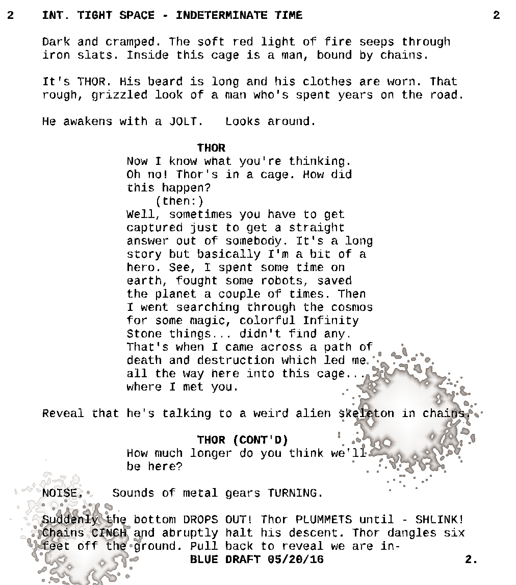

Shell scripts
=============

::: outcomes

* [X] Write and run shell scripts to repeat complex tasks.

:::

::: {style='float: left;width: 300px'}



:::

At this point you're pretty familiar with using the command line; you should be
able to do a variety of things:

* Navigate and create folder structures.
* Edit text files.
* Convert files between various formats.
* Filter lines from text files.
* Read and change permissions on files.
* Use version control software.
* Find files by name or properties.
* Redirect standard input, output, and error.
* Construct pipelines of commands.

While there's a whole world of things you can still learn about using the
command line, and more command line tools than you can imagine to learn about
(which sometimes themselves contain entire programming languages!), you've
learned and demonstrated a lot! :tada:

As you're getting more used to using the command line, you may find yourself
repeating similar, complex commands over and over again. Or maybe you find
yourself doing the same kinds of things over and over again, maybe running
multiple commands repeatedly. Or maybe you've built a complex pipeline that
you want to keep for use later because you'll need to use it again.

In their very simplest form, shell scripts are plain text files that contain a
sequence of commands or statements, separated by newlines or semi-colons. As you
grow shell scripts, they can contain things like conditional statements, loops,
functions, and... uh, hey, [wait a minute]. That, uh, that sounds an awful lot
like programming.

Most of the time we spend interacting with shells is interactive: the shell is
waiting for us to enter a command, and when we press <kbd>Enter</kbd>, the shell
runs the command, waits for it to finish (it actually `wait(2)`s, it's a C
function), then patiently waits for us to enter another command.

Most shells can also run non-interactively: you give the shell the name of a
file that contains a sequence of commands and the shell will just interpret,
then run the sequence of commands like it's a program.

[wait a minute]: https://youtu.be/g3YiPC91QUk?t=58

Shells and languages
--------------------

Similar to different programming languages, different shells use different
syntax to express similar ideas. Deciding which shell program to use defines
what syntax you're going to use and the kinds of keywords you should be using
when you're looking for help (in the manual page for the shell, on the shell's
website, or generally online).

While your default shell on Aviary is `tcsh`, we're going to be using `bash` as
a shell interpreter for scripting. This is an opinionated choice, just as
using `vim` instead of `emacs` is an opinionated choice. As you get more
comfortable using the command line, you may want to choose a different shell
(like `fish`) and thus a different shell language, but `bash` and its syntax are
common enough that we'll treat it like a "[lingua franca]".

[lingua franca]: https://en.wikipedia.org/wiki/Lingua_franca

Basic scripting
---------------

Let's start with the basics: the general structure of a shell script and some
very simple shell scripts.

### General structure

Shell scripts all start with a "[shebang]" line --- a line that starts with the
symbols `#!`. The first line indicates which program is going to be run to
interpret the rest of the file.

```bash
#!/usr/bin/env bash # this is a bash script
```

Everything after the first line is the actual contents of the script, the
sequence of commands to be executed.

[shebang]: https://en.wikipedia.org/wiki/Shebang_(Unix)

### Simple scripts

Here's an example of a very simple script:

```bash
#!/usr/bin/env bash

ls -la
```

Copy and paste this into a new plain text file on Aviary; give it a file name
that represents what this does (I recommend `la`, "list all").

::: aside

Copying and pasting into `vim` is tedious, having to enter and exit paste mode
is a real bother. Another way to quickly copy and paste into your terminal to
create a new file is using the program `cat`. As above, `cat` is a program that
will read standard input and write to standard output. But we can redirect
standard output to a file!

```bash
cat > la
```

Once you enter that, press <kbd>Enter</kbd>, then paste, then press
<kbd>Control</kbd>+<kbd>D</kbd>.

That's it!

:::

Once you've written the file, exit your editor. Before we can run a shell
script, we need to mark it as executable using `chmod`:

```bash
chmod a+x la
```

Then we can run the script:

```bash
./la
```

:tada:, your first shell script!

Shell scripts consist of one or more lines of commands to run. Add another line
to your script:

```bash
find . -name "*.md"
```

Then run it again (you don't need to `chmod` again). Now *two* commands worth of
output appear.

One command that you might find helpful when you're scripting is the `echo`
command, this is a "print" command for shells:

```bash
echo "Hello, world!"
```

You can also write comments using the `#` symbol, anything following is a
comment:

```bash
echo "Hello, world" # a friendly message
find . -name "*.docx" -delete # clean up Word files
```

::: example

Here's a more complete (and completely contrived) example of a script:

```bash
#!/usr/bin/env bash

echo "Here's what's in the current directory:"
# list all with long listings
ls -al

echo "Here are all the Markdown files:"
# find all files with the `.md` extension
find . -name "*.md"
```

:::

Environment variables and the `$PATH`
------------------------------------

Shell languages, like other programming languages, support variables.

Almost all shells follow the same convention for naming variables:

* Variable names start with a `$`,
* Variable names are all `UPPERCASE`,
* Variable names are [`SNAKE_CASE`] (they use underscores to separate words).

[`SNAKE_CASE`]: https://en.wikipedia.org/wiki/Snake_case

All shells have special variables, and those special variables help your shell
make decisions, or help define the behaviour that your shell has. These special
variables are called "environment variables".

::: example

Try running this in your shell to find out what shell you're using:

```bash
echo $SHELL
```

`$SHELL` is an environment variable that contains the name of the running shell.

:::

When you enter the names of programs on the command line, your shell has to
figure out where that program actually is in a folder structure.

::: aside

This is might seem obvious when you think about it, but think about it: the
programs that you're running on the command line are just files with bits in
them. They were written in a programming language (often C), then compiled and
put in a folder somewhere.

A lot of programs on Linux and UNIX systems live in the folders `/bin` and
`/usr/bin`. You can learn a bit more about where files live on a Linux system by
reading a manual page:


```bash
man hier 

### OR

man 7 hier # hier is in section 7 for miscellaneous
```

:::

Your shell uses a special environment variable called `$PATH` (often called
*the* `$PATH`) to find where the command you just entered exists as a file. The
`$PATH` contains a list of directories that your shell will look in to find the
file representing the command you asked it to run. Different shells use
different separators for directory entries in the path. Both `tcsh` and `bash`
use a colon `:` to separate directories.

::: example

As above, use the `echo` command to print out what the `$PATH` is right now in
your shell:

```bash
echo $PATH
```

:::

Your `$PATH` will contain many folders on Aviary, but it importantly includes
two directories:

1. `.`: the current directory, and this is why you don't have to type `./` in
   front of programs you've written and compiled yourself.
2. `~/bin`: a directory named `bin` relative to your home directory. When you
   `echo $PATH`, the `~` will be listed as an absolute path (e.g.,
   `/home/student/you/bin`).

What this means is that we can put scripts we write into the directory `~/bin`,
then we can run them *anywhere*.

::: example

The directory `~/bin` *may not* exist in your user directory on Aviary. Create
the directory, then move the `la` script you wrote above into this directory.

This applies **only** to `tcsh`: `tcsh` [caches] the names of commands that are
in folders on the `$PATH`. After you add something to `~/bin` (which is on your
`$PATH`), you've got to get `tcsh` to regenerate this cache. You can regenerate
the cache in `tcsh` by running the command:

```bash
rehash
```

You must do this any time you add programs or commands to folders on the `$PATH`
that you want to work in other places, but this only applies to `tcsh`. If
you're using a different shell like `bash` or `fish`, then your shell will
almost certainly do this for you.

Now change back to your user directory:

```bash
cd ~

### Or just `cd` with no arguments

cd
```

And run `la`. :tada:, now you can run `la` in *any* directory.

:::

You can find out which environment variables are currently set and what their
values are using the `env` command.

[caches]: https://en.wikipedia.org/wiki/Cache_(computing)

Arguments
---------

Shell scripts that you write can accept arguments, just like programs you write
in other programming languages. In both C and Java (and Python, technically),
you can access arguments passed on the command line to your program as arrays of
strings.

Shell scripts can access command line arguments using variables, but you can
directly access arguments on the command line as numbered variables like `$1`.

::: example

Here's a small program that will print out the values passed to it as arguments
on the command line:

```bash
#!/usr/bin/env bash

echo "The first argument is $1"
echo "The second argument is $2"
echo "The third argument is $3"
echo "All arguments are $*"
```

Write this script and try running it with different arguments to see how the
output changes. Don't forget to use `chmod` to set execute permissions for your
script!

:::

A common use of arguments on the command line for shell scripts is to pass the
name of a file or directory you want to operate on.

::: example

Let's upgrade our `la` script a little bit.

Remember that `ls` can run with no arguments, and when run with no arguments
it's defaulting to printing out the contents of the directory `.`. But `ls`
*can* accept arguments. Our `la` script doesn't right now.

Change your `la` script to accept an argument and pass it to `ls`:

```bash
#!/usr/bin/env bash

ls -al "$1" # quotes in case of spaces!
```

Now run `la` again, but pass it an argument:

```bash
la .
```

Neat.

::: aside

Why "quotes in case of spaces"? Try this:

1. Remove the quotes around `$1` in your script.
2. Create a directory that has a space in its name (`mkdir "space dir"`).
3. Try running `la "space dir"`.
4. Put back the quotes around `$1` in your script.

When the shell "expands" the variable `$1`, it's replacing the value of that
variable into the command *literally*. If the variable contains spaces, it will
be replaced in the command spaces and all. In other words,

```bash
ls -al $1 # becomes:
ls -al space dir
```

If you remember *way back a long time ago*, we had to put quotes around names
with spaces when using `mkdir` because `mkdir` would turn `space dir` into two
directories. Similarly, `ls` is looking for two separate directories.

Including the quotes around `$1` makes sure that even if the variable contains
spaces, it's going to be quoted when it's passed to the command:

```bash
ls -al "$1" # becomes
ls -al "space dir"
```

:::

:::

While we've improved `la` slightly here, we've also broken it. Try running `la`
by itself with no arguments.

...

Oops. Now we need to test for the special case of no arguments being passed.
We're going to need some more tools for that: conditional statements.

Structures: conditional statements and loops
--------------------------------------------

Shell scripting languages are fully featured programming languages and include
structures like conditional statements and loops. They contain other structures,
too, but let's stick to the basics.

### Conditional statements

Conditional statements in `bash` use the familiar `if` keyword and *resemble*
the expressions you've seen in other languages.

One of the major differences in `bash` are expressions themselves: most of the
questions you're going to be asking about a variable use unary operators.

Here's what a `bash` conditional statement looks like:

```bash
if [[ -a hello.c ]]; then
    echo "hello.c exists"
else
    echo "hello.c does not exist"
fi
```

The `-a` is a unary operator on file names. `-a` returns true if the file
exists, and returns false if the file does not exist.

Spacing is important here! `bash` is not a very smart language. You might be
tempted to leave out spaces between `[[` and `-a` or between `hello.c` and `]]`,
but you **must** have spaces between these symbols.

::: aside

WHY?!

`bash` is, uh, weird. `[[` is technically a command that takes arguments. The
arguments the `[[` command is getting in the above example are `-a`, `hello.c`,
and `]]`. The `;` is a line separator (like in Python it's optional, but can be
used).

Yeah, weird.

:::

`bash` has many unary operators that you can use to test files or variables. The
one we care about right now is the `-n` operator, asking if a string is non-zero
in length.

::: example

Let's add a conditional statement to `la` to test for the presence of arguments:

```bash
#!/usr/bin/env bash

if [[ -n "$1" ]] ; then
    ls -al "$1"
else
    ls -al
fi
```

:::

You can find more unary operators in `bash` by reading the `CONDITIONAL
EXPRESSIONS` section of its manual page, but here are some examples:

+----------------------+----------------------------------------------------+
| Operator             | Meaning                                            |
+======================+====================================================+
| `-a file`            | True if file exists.                               |
+----------------------+----------------------------------------------------+
| `-d file`            | True if file exists and is a directory.            |
+----------------------+----------------------------------------------------+
| `-r file`            | True if file exists and is readable.               |
+----------------------+----------------------------------------------------+
| `-s file`            | True if file exists and has a size greater than 0. |
+----------------------+----------------------------------------------------+
| `string1 == string2` | True if the strings are equal.                     |
+----------------------+----------------------------------------------------+

### Loops

We can't talk about conditional statements without at least saying something
about loops!

Similar to conditional statements, loops use the familiar `for` keyword. Bash
also supports `while` and `until` loops, but most of the time you're using a
loop in Bash, you're operating on some sequence of file names rather than until
some event happens.

The structure of a `for` loop is frustratingly different from conditional
statements in a way it's not in other programming languages --- the conditional
statements you saw above use the `[[` and `]]` brackets for wrapping the
expression, but `for` loops generally do not use brackets or parenthesis in
Bash.

Here's what a `for` loop looks like in Bash:

```bash
for f in * ; do
    echo $f
done
```

* The `for` is ... `for`, it's the start of the loop.
* The `f` is the name of the variable you want to use as the name for the value
  in the current iteration of the loop over the sequence.
* The `in` is a separator between the variable name and the sequence.
* In this case `*` *is* the sequence. This is a "glob" or a pattern, and this
  glob in the shell means "all files in the current directory".
* The semi-colon `;`, like in conditional statements above, ends the current
  statement.
* `do`, then is the beginning of the body of the loop.
    * `echo $f` is one command you want run on the variable. This will print out
      the variable's name.
* `done` ends the body of the loop.

::: aside

Maybe this looks sort of familiar. Maybe this looks like what we were doing with
`find` and `-exec`. They do accomplish similar results!

Both work, and both are effective. One way to think about this matching of ideas
is that `find` and `-exec` are more of a functional programming paradigm (this
is a `map` operation), `for` loops are more of a procedural paradigm.

:::

When you're writing `for` loops, the sequence can either use the patterns you've
seen before (like `*.md`), or can be the result of a *command*. 

In fact, we can rewrite the `for` loop from above using `find`!

```bash
for f in $(find . -maxdepth 1) ; do
    echo $f
done
```

The output looks a little bit different, but the result is the same.

Another common kind of loop you may want to write is one that iterates over a
sequence of numbers (like the traditional `for` loop you've seen in languages
like Java). To do that you can use the `seq` command:

```bash
for num in $(seq 1 10) ; do
    echo $num
done
```

Further reading
---------------

Just like programming, shell scripting goes way beyond what you've been
introduced to here. You've got a good start, but as you keep working with shell
scripting, you'll find yourself running into situations where you need to get
some more help.

* You can read the manual page for your shell to learn more about its scripting
  language (e.g., `man bash` or `man tcsh`).
    * Sections of interest in the manual page for `bash` include the
      `CONDITIONAL EXPRESSIONS` section and the `Compound Commands` subsection.
* Joshua Levy's "[The Art of Command Line]" is a very good resource that's been
  translated into many languages. It's a good reference to keep in your
  bookmarks.
* [ShellCheck] is a tool for identifying and then helping you fix possible bugs
  in your shell scripts.
* The [Advanced Bash-Scripting Guide] is a comprehensive guide for shell
  scripting with Bash.

[The Art of Command Line]: https://github.com/jlevy/the-art-of-command-line
[ShellCheck]: https://www.shellcheck.net/
[Advanced Bash-Scripting Guide]: https://tldp.org/LDP/abs/html/
