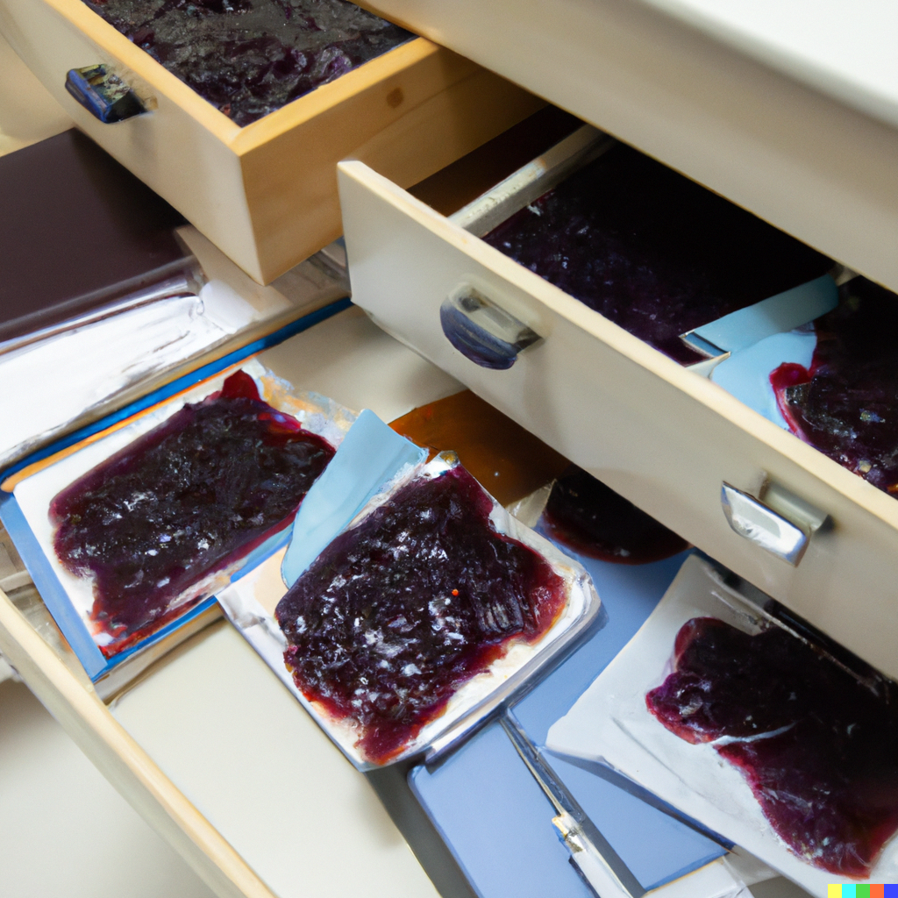

Globs
=====

More often than not, the loops that you would want to write in the shell are
intended to apply an operation to many files, and those files can be all in the
same directory, or scattered throughout many directories.

Shell languages (like Bash) have a feature called "globbing" that can help with
quickly getting a list of files to operate on in something like a loop in a
more reliable (and arguably easier!) way than using `find`.



::: aside

Why "*glob*"?

Apparently [it's short for "global"]. I definitely don't pronounce "glob" as 
"globe" (as in "global"), I pronounce it as in "glob" like a glob of jam.

[it's short for "global"]: https://en.wikipedia.org/wiki/Glob_(programming)#Origin

:::

Simple globs
------------

The simplest glob in a shell is the `*` character. This glob "expands" to all
files in the current directory that are not hidden.

::: example

If you have the following files in your current directory:

```
[you@bird fortnight8]> ls -a
. .. .gitignore hello.md hello.docx script.sh
```

Then the `*` glob would "expand" to `hello.md hello.docx script.sh`:

```bash
[you@bird fortnight8]> echo * # prints out the names of all files and folders in this directory
hello.md hello.docx script.sh
```

This actually means that the `echo` program was run with *two arguments*, not
just one. Before the shell launches the `echo` program, it effectively replaces
the `*` in the command line with `hello.md hello.docx script.sh`.

:::

::: challenge

Write your own shell script that prints out what its arguments are using the 
numbered argument variables (`$1 $2 $3`...) to see how a simple glob expands
in different directories.

:::

Advanced globs
--------------

Simple globs are the ones you will use most often because you *usually* want to
do something to everything in the current directory. But simple globs are not
the only kind of globs. Let's look at two other kinds of globs: 

1. Begins-with, ends-with, or contains globs
2. Directory globs

### Begins-with, ends-with, or contains globs

If you remember *way back* to [fortnight 5 in COMP 1002], you learned about a 
program named `grep` that could be used to filter lines from a file based on a
pattern that you provided. The patterns that you gave to `grep` *also* use the 
`*` symbol to indicate "anything", but we saw that you could put the `*`
anywhere within a string.

We can do the same thing with globs!

::: example

We can match all file names that begin with `hello` using a glob `hello*`:

```bash
[you@bird fortnight8]> echo hello* # assuming the same directory as above
hello.md hello.docx
```

Or we can match all file names that end with `.md` using a glob `*.md`:

```bash
[you@bird fortnight8]> pandoc *.md -o all.docx # run pandoc, passing *all* of
                                               # the markdown files in the 
                                               # current directory, and convert
                                               # them all into a single Word
                                               # document
```

Or you can match file names that contain the letters `ll` using a glob `*ll*`:

```bash
[you@bird fortnight8]> cat *ll*
# contents of hello.docx get printed out (which is a bunch of garbage!)
# contents of hello.md get printed out
```

:::

[fortnight 5 in COMP 1002]: https://university-of-manitoba-computer-science.github.io/tools-n-techniques/topic05/topic-3.html

### Directory globs

Globs are helpful for matching many files in a directory, but [we don't keep all
of our files in one directory], right? (Right?!)

We can also use globs to help us find files that are in subdirectories, but we 
have to change the way we're writing out glob: instead of using one `*`, we use
*two* `**`:

::: example

Download (or find) [crazy-directories.tar] (use `wget`!). We previously used
`find` to, uh, find the Markdown files in this massive blob of directories. We
can also use globs to help us.

Extract `crazy-directories.tar` (if you just downloaded it), then change into
the directory. We can use globs to find all Markdown files in this directory:

```bash
[you@bird crazy-directories]> ls **/*.md # find files with names ending with .md
                                         # in any subdirectory
```

[crazy-directories.tar]: https://university-of-manitoba-computer-science.github.io/tools-n-techniques/topic05/crazy-directories.tar

:::

The technical Bash name for this feature is not "directory glob", but is instead
called "globstar".

[we don't keep all of our files in one directory]: https://university-of-manitoba-computer-science.github.io/tools-n-techniques/topic01/topic-5.html

Further reading about globs
---------------------------

You can read more about globs in a few places:

* The manual pages: use `man 7 glob` (or [manual pages online]).
* The [Advanced Bash-Scripting Guide] has even more kinds of globbing (using 
  curly braces `{}` and question marks `?`).
    * [Chapter 37] of the Advanced Bash-Scripting Guide has more examples of how
      to use directory globs.

[manual pages online]: https://www.man7.org/linux/man-pages/man7/glob.7.html
[Advanced Bash-Scripting Guide]: https://tldp.org/LDP/abs/html/globbingref.html
[Chapter 37]: https://tldp.org/LDP/abs/html/bashver4.html#GLOBSTARREF
