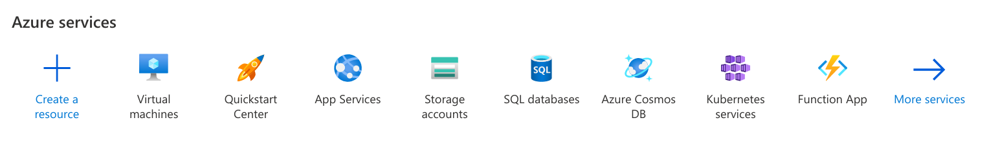
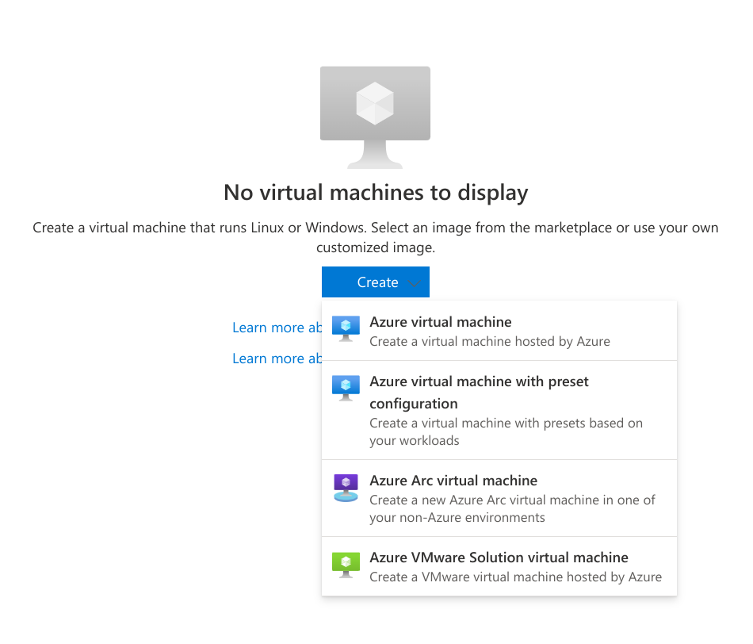

Initialize a server in a public cloud
=====================================

::: outcomes

* [X] Initialize a server in a publicly available cloud computing environment
  (e.g., AWS).

:::

VMs are pretty cool! Containers are also pretty cool, they enable us to do stuff
on our own machine that we couldn't do before.

Let's move off of our machine into the cloud.

)](clouds.jpg)

What even is a cloud?
---------------------

> A visible cluster of water droplets and/or ice particles in the
> atmosphere. ([Weather and meteorology glossary])

That... doesn't seem like it's for [the right course].

What's a cloud in the context of computing?

> Cloud computing is a model for enabling ubiquitous, convenient, on-demand
> network access to a shared pool of configurable computing resources (e.g.,
> networks, servers, storage, applications, and services) that can be rapidly
> provisioned and released with minimal management effort or service provider
> interaction. ([NIST])

... wow, I think the definition of what a literal cloud is was easier to
understand.

I think we'll be able to better understand what cloud computing is in the
context of how we got to cloud computing, so let's take a brief detour define
some terms.

A **server** is a computer. A laptop can be a server, a desktop can be a server,
or a rack-mounted computer can be a server.

)](servers.jpg)

We usually call a computer a server when that computer is sharing some of its
resources (files, access to other networks, applications) over a network.

Not *that* long ago, the choices you had were limited for running a server on
the internet. One was to buy a server, then pay rent to have that server put
into a rack in a data center (a building with a very fast internet connection,
air conditioning, and support staff). This is expensive if all you want to do is
share your personal home page on the internet, but might make sense if you're
running an application that many people use.

Eventually virtual machines appeared, and instead of buying or renting an entire
server, companies began to sell or rent *virtual machines* --- a hosting company
could buy one large physical rack mounted server and run many virtual machines
on that one single machine, then sell access to those virtual machines.

This is appealing because 1) you only have to pay for what you're actually
using, and 2) paying for more CPUs or memory when you need it is trivial
compared to buying a new physical server. These companies also created their
own suite of web applications and web sites for managing access to these virtual
machines, and this is effectively what "the cloud" is: renting virtual machines
in someone's data center.

[Weather and meteorology glossary]:
  https://www.canada.ca/en/environment-climate-change/services/weather-general-tools-resources/glossary.html#wsglossaryC

[the right course]: https://umanitoba.ca/environment-earth-resources/
[NIST]: https://www.nist.gov/publications/nist-definition-cloud-computing

What cloud are we using?
------------------------

There are three major cloud providers:

1. [Amazon AWS].
2. [Google Cloud].
3. [Microsoft Azure].

All of these cloud providers have free tiers: either by giving you a certain
amount of credit or by specifying kinds of virtual machines with small amounts
of resources that are free to use. Unfortunately, though, even though they are
free, most require you to provide a credit card for if or when you go beyond
what's being provided for free.

We're going to be using Microsoft Azure for one specific reason: Students get
free access to Azure without needing to provide a credit card; there are no
other technical or other reasons for choosing Microsoft over the other cloud
providers.

[Amazon AWS]: https://aws.amazon.com/
[Google Cloud]: https://cloud.google.com/
[Microsoft Azure]: https://azure.microsoft.com/en-us/

Running your own server in the cloud
------------------------------------

With that out of the way, let's get started on getting a server running on a
cloud provider!

### Sign up

Sign up for [Azure for Students] using your `@myumanitoba.ca` e-mail address.
You must use your U of M e-mail address because it's proof that you're a current
student at the U of M.

[Azure for Students]: https://azure.microsoft.com/en-ca/free/students/

### Spin up your server

Once you've set up your account we can start working on setting up a server.

Begin by going to [your main Azure page]. There's a lot going on on this page!
We're looking to set up a new virtual machine. You should see a section labelled
"**Azure services**" near the top of the page:



We want to launch a new virtual machine, so click on "Virtual machines".

This will take you to a page that has a list of the virtual machines that you
currently have running on Azure. You don't have any yet, so this list will be
empty. In the middle of the page should be a button labelled "Create", click it,
then click on "Azure virtual machine".



Next you're going to be able to choose options about your new virtual machine.
There are a lot of options, but let's try to take a look at each of them, and
suggest some reasonable values you can choose for each.

* **Subscription**: You should only have one choice here (Azure for Students)
  unless you've signed up for Azure before.
* **Resource Group**: When you create a virtual machine on Azure, many different
  "things" are going to be created that are related to each other, but are
  reported separately (e.g., the address for your virtual machine is reported
  separately from the virtual machine itself). You should select "(New) Resource
  Group".
* **Virtual machine name**: Give your new virtual machine a name! Naming things
  is hard. You can name this whatever you want for this exercise, but typically
  you name virtual machines with their intended purpose (e.g., database, web,
  app).

  ::: aside

  Naming things is hard. You've actually seen a naming convention already:
  Aviary. Aviary is not one computer, it's many computers, and
  `aviary.cs.umanitoba.ca` is a "round-robin" DNS entry (remember, it's a joke;
  ha ha).

  You can find a [list of lists of naming conventions] if you're looking for
  inspiration.

  [list of lists of naming conventions]: https://namingschemes.com/Main_Page

  :::
* **Region**: This is the approximate location of where the computer running
  your virtual machine will be physically located. I would recommend that you
  pick something close to home: "(Canada) Central Canada" (Winnipeg is near the
  [Centre of Canada], but apparently this data centre is actually in or near
  Toronto).
* **Availability options**: Virtual machines can be running in *many* locations
  and not just one. The idea is that if one data centre goes offline, another
  one will seamlessly pick up your virtual machine and keep it running. Our plan
  is to bring up the virtual machine so that we can connect to it and that's
  about it, so leave this set to "No infrastructure redundancy required".
* **Security type**: You can choose the kinds of physical security devices that
  are attached to the computer your virtual machine is running on. We don't
  really care about this, but if your app is working with personally
  identifiable information you might care about this option. For now you should
  select "Standard".
* **Image**: This is where you're picking which operating system is going to be
  running in your virtual machine. There are both Windows and Linux options.
  You're welcome to pick whichever you want, but I would recommend you pick
  "Ubuntu Server 20.04 LTS - Gen2".
* **VM architecture**: You can choose what kind of physical processor is going
  to be used to run your application. Arm64 is effectively the same as Apple's
  M1 and M2, or the processor that's running in your phone. x64 is effectively
  the same as what's in most PCs. You must pick "x64" for this option, the free
  tier that we're using doesn't yet have any Arm64 options.
* **Size**: This is where you get to pick how much CPU and memory you want in
  your virtual machine. We're not doing much with this virtual machine, so we
  don't need to pick anything crazy here. I would recommend that you pick
  "Standard_B1s".
* **Authentication type**: Pick "Password".
* **Username**: Pick a username. This could be the same as your username on
  Aviary, it can be something else. Pick whatever you would like.
* **Password** and **Confirm password**: Pick a password.
* **Public inbound ports** and **Select inbound ports** you can decide what
  kinds of applications are going to be running on your server. We only want SSH
  right now, so leave this as the default.

Finally, click on the blue "Review + create" button at the bottom. You can
review the details here, then click on the blue "Create" button.

When you click the create button, Azure will slowly create your virtual machine
and all of the other resources required to get it running. This shouldn't take
too much time, and you'll eventually see a message reporting something like
"Your deployment is complete".

Once that message appears, click on the blue "Go to resource" button to see the
details of your machine.

There's a lot, but you've just stared a virtual machine in the cloud :tada:!


[Centre of Canada]: https://en.wikipedia.org/wiki/Centre_of_Canada
[your main Azure page]: https://portal.azure.com/#home

### Connect with SSH

The main thing we're interested in right now is the virtual machine's address.
Remember: our goal is to connect to our virtual machine with SSH, and the three
pieces of information we need to connect to a server with SSH are:

1. The address of the server.
2. Our username (how we identify ourself).
3. Our password (how we prove that we are who we say we are).

You set the username and password yourself when you were setting details for the
server.

You can find the address of your server on the right side of the page under the
"Networking" heading. You're going to see a sequence of numbers and not a
friendly name (like aviary). This is an [IP address]. You can use an IP address
in the same way as you can a domain name when you're connecting with SSH:

```bash
ssh you@10.10.3.4
```

Connect to your server with SSH!

[IP address]: https://en.wikipedia.org/wiki/IP_address

### Shut it down!

OK awesome! You're welcome to start playing with this virtual machine (it's just
another Linux server, similar to Aviary), but at this point we're done, we've
accomplished what we set out to do.

Back in your Azure portal you should click on the Stop button at the top of the
page.

Further reading
---------------

Initializing a new server feels like just scratching the surface, and it really
is. We'll soon look at managing a Linux installation, but for now we're going to
stop at initializing the server.

If you're interested in learning more, you should check out some resources
provided by the different cloud providers:

* Microsoft's [Training for Azure] has many high quality and structured
  tutorials for working with virtual machines in Azure.
* Amazon's [AWS SkillBuilder] similarly has high quality and structured
  tutorials for working with AWS.
* Google's [Cloud Documentation] ... *similarly has high quality and structured
  tutorials for working with Google Cloud*.

[Training for Azure]: https://learn.microsoft.com/en-us/training/azure/
[AWS SkillBuilder]: https://explore.skillbuilder.aws/learn
[Cloud Documentation]: https://cloud.google.com/docs
