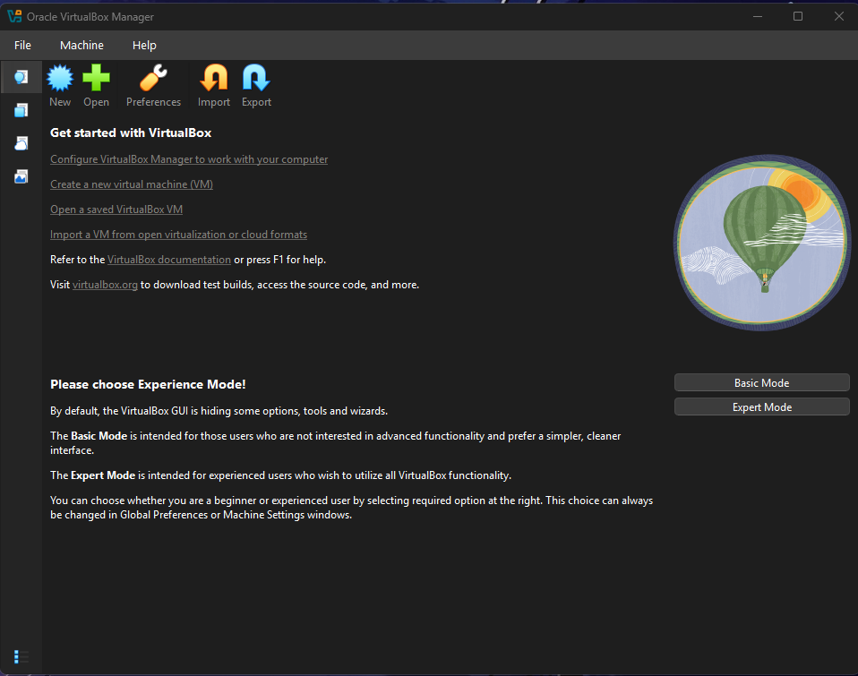
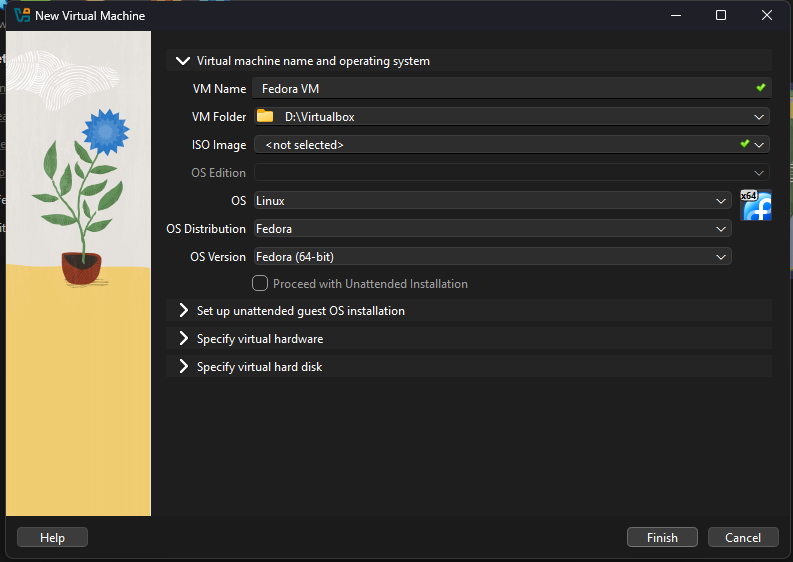
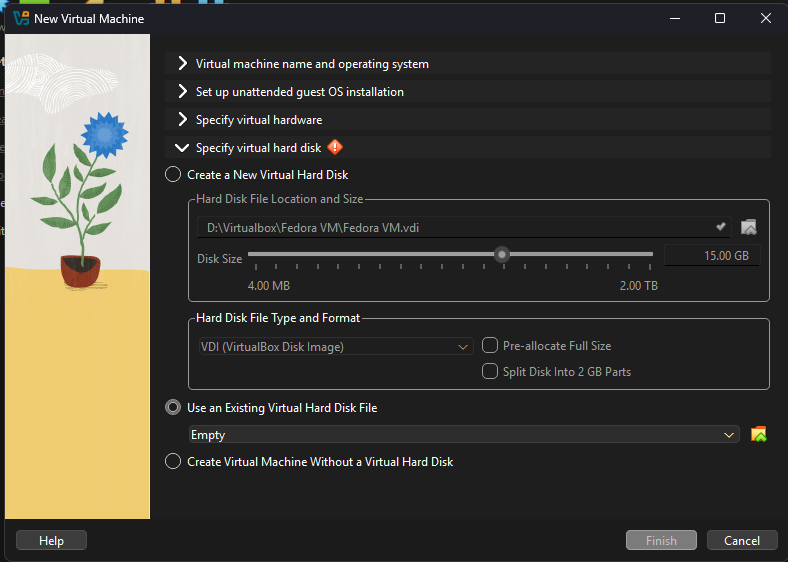

::: outcomes

* [X] Download and use a pre-installed operating system in a virtual machine
  software.

:::

You've been using Windows or macOS (or maybe Linux!) on your personal computer
and you're using Linux when you connect to Aviary.

We're going to try something a little different here and use a different
distribution of Linux called [Fedora].

::: aside

This course used to use [SerenityOS], but switched images as they had no native
ARM support.

SerenityOS is a fascinating project: it's a brand new, from scratch operating
system and environment that was started by one person that's grown into a pretty
big community.

The main author of SerenityOS (Andreas Kling) has been developing SerenityOS
entirely in the open, including [live-streaming coding on YouTube].

[SerenityOS]: https://serenityos.org/
[live-streaming coding on YouTube]: https://www.youtube.com/c/AndreasKling

:::

[Fedora]: https://fedoraproject.org

Download an image
=================

We're going to download an "image". The full name for this thing is "disk
image", this is a bit for bit copy of a hard drive or disk. Everything else that
we need to set up is going to be done in VirtualBox itself.

::: warning

For our virtual machine, we are going to use one specific version from March 2026.
Download the Fedora image from the following links

<details><summary>On x86_64 (Windows/Linux)</summary>

[x86_64 download link]

</details>

<details><summary>On ARM (macOS)</summary>

[ARM download link]

</details>

[x86_64 download link]: https://travisfriesen.ca/fedora-43-1.6.x86_64.vdi.gz
[ARM download link]: https://travisfriesen.ca/fedora-43-1.6.aarch64.tar.gz

:::

The latest image of Fedora can be found here:
<https://fedoraproject.org/workstation/download/>

The images that we provided have already been installed and setup for this
class. The images that we have provided is a "Virtual Machine Disk" or a "Virtual Disk Image" file depending on if you have the x86_64 or the ARM image, this
contains the hard drive for the virtual machine.

The image that you download is compressed using GZip, so you're going to need to
decompress the image before you can use it with VirtualBox.

<details><summary>Decompressing with macOS or Linux</summary>

Open your terminal and change directory to where the image was downloaded
(probably your Downloads) folder.

Once you're there, you can decompress it with `gunzip`:

```bash
gunzip *.gz
```

</details>

<details><summary>Decompressing with Windows</summary>

Windows doesn't support decompressing GZipped files by default, so you're going
to need to install a new decompression tool that does.

We recommend you install [7-zip]; it's free and open source, supports a really
wide variety of compression formats, and is fast.

Once you've installed 7-zip, you should be able to just double-click on the file
you downloaded and decompress it.

[7-zip]: https://7-zip.org/

</details>

Create a new VM
===============

We're going to be creating a new VM from an existing image. You'll need to
enable Expert Mode.

Then configure your VM following these settings, specifying the downloaded image
under "Specify virtual hard disk > Use an Existing Virtual Hard Disk File"








Run the VM
==========

Once you've got the VM configured, it's time to [start it]!

If everything worked out, you should see Fedora starting up :tada:!

[start it]: https://www.virtualbox.org/manual/ch01.html#intro-running

Snapshots
---------

One thing we can do with running virtual machines that we can't do with physical
hardware is *take snapshots* :camera:. Taking a snapshot of a virtual machine
gives you the ability to capture the state of the virtual machine, then go back
to that state.

Read a bit more about snapshots in [the VirtualBox documentation about
snapshots], then try it out!

[the VirtualBox documentation about snapshots]:
https://www.virtualbox.org/manual/ch01.html#snapshots
