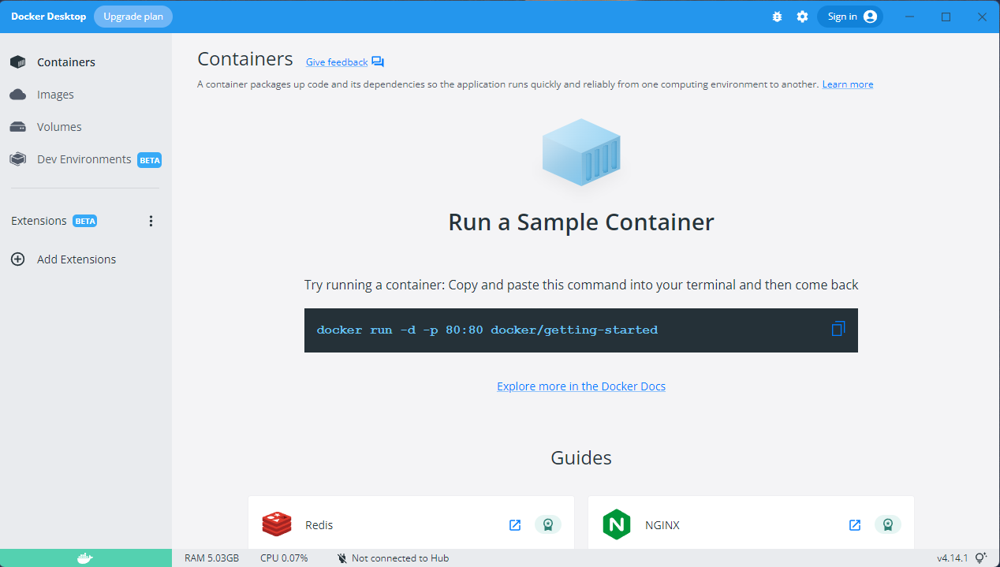

Run a command within a container
================================

::: outcomes

* [X] Run a command within a container.

:::

[Containers] are related to virtual machines, but aren't the same thing. The main
difference between a container and a virtual machine is that a container **does
not** contain or run an entire operating system. Instead, containers run
*within* an existing operating system. The theory is that a container uses fewer
resources because it doesn't carry all the extra baggage of a complete operating
system.

One fairly common use of containers is to distribute complex software and its
dependencies as a single "image", similar to what you downloaded for SerenityOS
when you were setting up a virtual machine. An image is basically an archive of
an operating system's folder structure.

We could spend an entire course talking about the technical foundations of
containers (that would be an *amazing* systems course), but in this course our
goal is simple: install enough software to get a command running in a container.

[Containers]: https://en.wikipedia.org/wiki/OS-level_virtualization

Install Docker Desktop
----------------------

Undoubtedly the most popular container management software is [Docker].

Docker has a highly polished visual environment for managing containers called
[Docker Desktop].

You should install Docker Desktop on your personal computer, following the
instructions provided in [Docker's documentation].

::: warning

If you're installing Docker Desktop on Windows, you're going to need to install
the Windows Subsystem for Linux. There's a link in Docker's documentation, but
for completeness, you can find [documentation about how to install WSL on
Microsoft's web site].

:::

[Docker]: https://www.docker.com
[Docker Desktop]: https://docs.docker.com/desktop/
[Docker's documentation]: https://docs.docker.com/get-docker/
[documentation about how to install WSL on Microsoft's web site]:
https://learn.microsoft.com/en-us/windows/wsl/install

Run a command within a container
--------------------------------

The simplest container command to run is "hello world", so let's start with
that, then move on to something a little more complex.

::: example

Let's start by running the Docker Desktop app on your computer. This step isn't
required (you don't need to start Docker Desktop before running any commands),
but gives us an idea of the kinds of things we can do with Docker Desktop.



We're not going to do anything with Docker Desktop, but note the tabs on the
left:

* **Containers**: This is a list of running containers that you can inspect and
  interact with.
* **Images**: These are the container images that have been downloaded for
  launching containers on your machine.
* **Volumes**: Containers can't see or interact with the files on your computer
  at all (they're completely self-contained). Volumes are a way for you to share
  folders from your computer to a container so that you can either provide
  inputs or receive outputs from a container.

Let's run a hello world container. If you had a terminal open before, close your
terminal and re-open it; your `PATH` variable (yes, there is a `PATH` on all of
Windows, macOS, and Linux) was modified by Docker Desktop when you installed it.

Once your terminal is open again, run the following:

```bash
docker run hello-world
```

You should see some output from Docker:

```
PS C:\Users\you> docker run hello-world
Unable to find image 'hello-world:latest' locally
latest: Pulling from library/hello-world
2db29710123e: Pull complete
Digest: sha256:faa03e786c97f07ef34423fccceeec2398ec8a5759259f94d99078f264e9d7af
Status: Downloaded newer image for hello-world:latest

Hello from Docker!
This message shows that your installation appears to be working correctly.

To generate this message, Docker took the following steps:
 1. The Docker client contacted the Docker daemon.
 2. The Docker daemon pulled the "hello-world" image from the Docker Hub.
    (amd64)
 3. The Docker daemon created a new container from that image which runs the
    executable that produces the output you are currently reading.
 4. The Docker daemon streamed that output to the Docker client, which sent it
    to your terminal.

To try something more ambitious, you can run an Ubuntu container with:
 $ docker run -it ubuntu bash

Share images, automate workflows, and more with a free Docker ID:
 https://hub.docker.com/

For more examples and ideas, visit:
 https://docs.docker.com/get-started/

PS C:\Users\you>
```

:tada: you just started and ran a container on your computer!

When you go back to Docker Desktop, you'll be able to see that in the Containers
tab is a container with the image `hello-world:latest` that has "Exited". This
is the container you just ran.

You can technically run it again by pressing the play button :arrow_forward: on
the right side of the window, but it's not going to do anything because the
`hello-world` image prints to standard output, and there is no standard output
display in Docker Desktop.

You can (and probably should) delete this container by clicking on the trash can
:wastebasket: icon on the far right side of the window.

:::

Hello world is always our classic "let's try this out for the first time"
exercise, and while interesting, isn't really giving us a good idea of the kinds
of things we can do with containers --- we were already able to write our own
self-contained "Hello world" programs in Java, C, or Python (or whatever). Let's
step up to something a little bit more complicated.

::: example

Let's follow the advice of Docker Desktop and "Run a Sample Container". Run the
following in your terminal:

```bash
docker run -d -p 80:80 docker/getting-started
```

Docker does some stuff to download an image and then... nothing?

Let's step through what each of these options mean:

* **`run`** is... well, it means download the image and run a new container
  using that image as a basis. We saw that happening, `docker` prints out a
  bunch of fancy animations showing progress downloading images.
* **`-d`** is "`d`etach". This means that Docker is going to start the
  container, and then run it "in the background" (the container will still be
  running, but you can continue to use your terminal).
* **`-p`** is "`p`ort forwarding". This is getting pretty far outside the scope
  of our course, but one way to interact with applications is through a
  "[port]". Port 80 is the port for [HTTP], and HTTP is the "protocol" (sort of
  like the language) that your web browser (Chrome, Firefox, Safari, Edge) use
  to talk to web servers. This is a bit of a hint about how to start interacting
  with this container.
* **`docker/getting-started`** is the name of the image that we want this
  container to use when it launches.

You can check in Docker Desktop and see that this container is indeed running:


Notice that you can click on the entry in the "Port(s)" column for this
container. Click on it!

Hey! Look at that! You're running a web server in this container, and your web
browser is interacting with the web server in the container. :tada:

This web server actually contains extensive documentation for using Docker, so
if you're looking for some further reading about Docker, this is one place you
can find it.

[port]: https://en.wikipedia.org/wiki/Port_(computer_networking)
[HTTP]: https://en.wikipedia.org/wiki/Hypertext_Transfer_Protocol

:::

Running a web server in a container is an example of a long-running application.
Let's do something that's a little bit different: we're going to run `pandoc` in
a container.

... `pandoc`? That feels a little underwhelming.

OK, well, sure, it's *familiar*, but we're going to be doing things in a
container that has a bunch of stuff configured that you can't do with the base
`pandoc` install, including being able to produce PDFs on your Windows or macOS
machine without installing $\LaTeX$.

::: example

We're going to use [pandocker]. Let's write ourselves a little Markdown file
that takes advantage of some features in [pandocker] that we can't do with the
base `pandoc` install:

    https://code.cs.umanitoba.ca/cs-lab-course/hello-pandocker/-/raw/main/hello-pandocker.md

You should use this file to:

* Create a PDF on Aviary with `pandoc`

  ```bash
  pandoc myfile.md -o myfile.pdf --toc
  ```

  Then transfer the PDF back to your own computer so you can see what it looks
  like.
* Create a PDF on your own machine with Pandocker using the following command:

  <details><summary>macOS or Linux</summary>
  ```bash
  docker run --rm -v `pwd`:/pandoc dalibo/pandocker:stable \
    $YOUR_FILE.md -o $YOUR_FILE.pdf --filter pandoc-latex-admonition \
    --template eisvogel --toc --pdf-engine=xelatex --listings
  ```
  </details>

  <details><summary>macOS with Apple Silicon</summary>
  ```bash
  docker run --platform=linux/amd64 --rm -v `pwd`:/pandoc \
    dalibo/pandocker:stable $YOUR_FILE.md -o $YOUR_FILE.pdf \
    --filter pandoc-latex-admonition --template eisvogel --toc \
    --pdf-engine=xelatex --listings
  ```
  </details>

  <details><summary>Windows with PowerShell</summary>
  ```bash
  docker run --rm -v ${PWD}:/pandoc dalibo/pandocker:stable lecture.md -o `
    lecture.pdf --filter pandoc-latex-admonition --template eisvogel --toc `
    --pdf-engine=xelatex --listings
  ```
  </details>

These two outputs are pretty different! As it is, you **can't** generate the
same output on Aviary as you could with Docker and pandocker on your own
machine --- configuring Pandoc with all of the required filters, templates, and
supporting software is tedious and painful.

There are a lot of options in this, but most of them are actually options for
`pandoc` and not Docker. Let's step through the Docker options:

* **`--rm`**: This option tells docker to remove the container after it exits.
  This is a short-running container, so removing it once it's exited makes
  sense.
* **`-v (pwd):/pandoc`**: This is how we share files with a container. The `-v`
  option is to "bind mount a volume". The short of this is that inside the
  container is another directory structure, and `pwd` (your present working
  directory) is shared inside the container at `/pandoc`.

That's it for Docker options! The rest are options to `pandoc` that you can read
about in the documentation for `pandoc`.

:tada: You just ran `pandoc` in a container!

[pandocker]: https://github.com/dalibo/pandocker

:::

Further reading
---------------

You've seen two examples of how to use containers, but you might want to know
more about how to create your own containers.

* Read more about creating containers in [Docker's Get Started], either on
  Docker's web site or in the getting started container you launched earlier.
  This will take you further into containers and get you creating your own
  containers.
* Docker isn't the only tool for managing containers, [Podman] is an alternative
  tool for managing containers.
* If you're looking for a deep dive alternative, [FreeBSD Jails] predate the
  idea of containers.

[Docker's Get Started]: https://docs.docker.com/get-started/
[Podman]: https://podman.io/
[FreeBSD Jails]:
https://freebsdfoundation.org/freebsd-project/resources/introduction-to-freebsd-jails/
