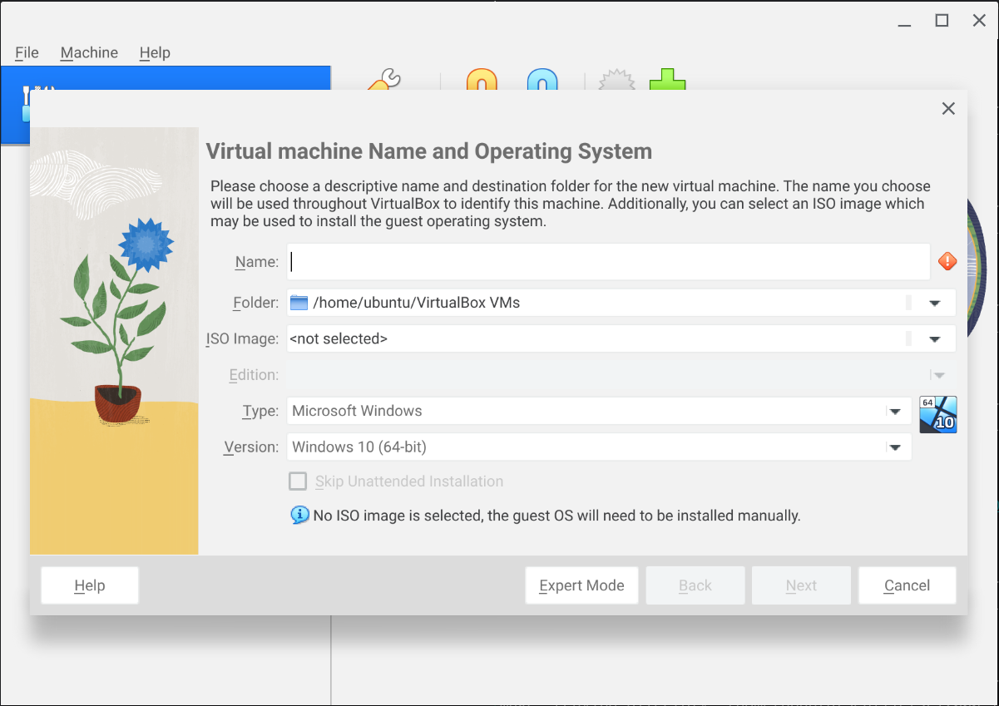

Install a Linux distribution
============================

::: outcomes

* [X] Install the Linux distribution either on your laptop or in a virtual machine.

:::

We're going to move forward here with the assumption that you've selected
Ubuntu. You're more than welcome to try other distros, but you're on your own
for getting it installed.

You've got two choices here in terms of where you install Ubuntu:

* A virtual machine.
* Real hardware.

At a certain points these paths start together, diverge, then converge again.

Where are you installing *to*?
------------------------------

Before you start, decide where you're going to install it:

* Real hardware. Maybe you've got an old laptop. Maybe you're using the lab
  computer. Maybe you're feeling **very** confident that you can get Linux
  working on your laptop with zero issues just before your final exams. Do this
  only if you know you're going to be OK going forward (we take no
  responsibility for lost data or lost use of your machine).
* A virtual machine.

If you're installing in a VM, VirtualBox is fine. ... unless you're using an M1
Mac.

If you're using an M1 Mac, you should uninstall VirtualBox and instead install
[UTM]. UTM is free and open source. You can support the developer by buying it
on the App Store, or you can [download it from GitHub].

[UTM]: https://mac.getutm.app/
[download it from GitHub]: https://docs.getutm.app/installation/macos/#github

Download the ISO
----------------

Once you've decided where you're going to install, we've got to actually get our
Linux distribution. Most Linux distributions are distributed as disk images, but
the kind of disk image here is a CD or DVD. Disk images for CDs and DVDs have an
extension of `.iso` and are generally called "ISOs".

::: aside

Why "ISO"?

They're called ISOs because it's a disk image that uses a format called "ISO
9660". [ISO 9660] is a "[file system]", it's a binary data structure that's used
to represent files, folders, and metadata on a disk or other hardware.

[ISO 9660]: https://en.wikipedia.org/wiki/ISO_9660
[file system]: https://en.wikipedia.org/wiki/File_system

:::

Here's a link to download `.iso` files:

    https://cdimage.ubuntu.com/jammy/daily-live/current/

If you're using Windows or a Mac with an Intel processor, download
`jammy-desktop-amd64.iso`. If you're using a Mac with Apple Silicon, download
`jammy-desktop-arm64.iso`.

Set up your machine
-------------------

Here's where our instructions diverge for a while: if you're using a Virtual
Machine, read below about either [VirtualBox] or [UTM]. If you're planning on
installing Linux onto an actual machine, read more in [Real hardware].

### Virtual machines

If you don't want to commit to installing Linux on a real machine, that's
totally OK. Thankfully, it's straightforward to install Linux in a VM.

This is so common, in fact, that a lot of VM software can completely automate
the installation of Linux from a disk image. We don't actually want to do that,
we want to go through the install process so that we can see what it looks like.
The goal here is to make sure we're setting up our VM to allow us to go through
the install process.

#### VirtualBox

Open VirtualBox and start creating a new virtual machine by either clicking on
the "New" button in the toolbar at the top, using the **Machine** menu and
selecting **New...**, or by pressing <kbd>Control</kbd> or
<kbd>Command</kbd>+<kbd>N</kbd> on your keyboard. VirtualBox is going to ask you
for some details about your new VM:

You should fill in the details here:

* **Name**: Give your VM a name! You can name it anything you like, but like
  naming variables, pick something descriptive.
* **Folder**: You can choose to put your VM's files somewhere else, but it's OK
  to leave this as the default.
* **ISO Image**: Click on the arrow on the far right side of this field and
  select "Other...". Now find the ISO you downloaded and select it.

Once you select the ISO, VirtualBox is going to change its interface a little
bit and helpfully let you know that the OS can be "unattendedly" installed (I
guess if you write it into a program is becomes a word). You should check off
"Skip Unattended Installation", then click "Next".

On the next screen you'll get a chance to choose some options for hardware.
VirtualBox has selected sane defaults here, but you can do things like giving
your virtual machine more RAM, or more CPU cores to work with:

Click "Next", and VirtualBox will let you configure the virtual hard drive.
Again, VirtualBox has selected a sane default here of 25GB, but you can choose
sizes up to 2TB.

::: aside

The virtual hard drive you create here will literally be a file on your file
system. VirtualBox gives the guest OS the idea that there's a real hard drive,
and any reads or writes that the guest OS makes will be forwarded to this file.

:::

VirtualBox won't actually make a 25GB file (thankfully!) by default. Instead, it
allocates only as much as is actually being used by the guest OS. At the
beginning this will be closer to a few GB, maybe up to 10GB, depending on the
software you choose to install during setup.

You *can* get VirtualBox to allocate a full 25GB file at the beginning by
ticking the "Pre-allocate Full Size" check box, but you shouldn't do this right
now.

::: aside

Why would you *want* to pre-allocate the full disk??? That seems like a big
waste of space if you don't actually use the whole hard drive, you can't get
that 25GB back!

There are some compelling reasons why:

1. Performance. If you pre-allocate the entire disk, VirtualBox won't have to
   decide if it needs to make the file bigger while the guest is running because
   the disk is already big enough. The reality of this, though, is that unless
   your guest is constantly writing stuff to disk (it's not), the additional
   performance gain isn't usually worth the cost of losing that space in the
   host.
2. Making sure you're not oversubscribing your disk. If you're in a situation
   where you've got *many* guests running, you can guarantee that all guests
   will have enough disk space if you pre-allocate the disk space. If you don't
   pre-allocate, it's possible for you to have many guests trying to use more
   space than is available on the physical drive (e.g., you've got 20 guests
   where each have a 2TB virtual disk and you've got a 250GB physical disk).

:::

Finally, click "Next", optionally review the details of your VM, then click
"Finish". Hooray :tada;! You just created another VM!

Now it's time to [Boot] your VM.

#### UTM

UTM actually has pretty good documentation on [how to get Ubuntu set up].

Some (minor) differences and explanation:

* You're going to be using a Desktop ISO for Ubuntu, so you don't need to
  install `ubuntu-desktop` after you've finished.
* Similar to VirtualBox above: UTM picks pretty reasonable values for the amount
  of memory and disk space that the virtual machine is going to get.
* Similar to VirtualBox above: The virtual hard drive you create here will
  literally be a file on your file system. UTM gives the guest OS the
  idea that there's a real hard drive, and any reads or writes that the guest OS
  makes will be forwarded to this file.
* UTM makes folder sharing (a folder on your host will be made available in your
  guest) a little easier in that it's a set up option.
* The last step in the UTM docs (step 9) is important:
    * The reboot will almost certainly fail. You should power off the machine
      yourself.
    * After you power off the machine, "unmount the installer ISO" by looking at
      the details of the machine on the right, scrolling down and finding the
      "CD/DVD" drop-down and choosing "Clear".

[how to get Ubuntu set up]: https://docs.getutm.app/guides/ubuntu/

Once you've got the VM set up, you can move on to the [Boot] section.

### Real hardware

If you're planning to run this on real hardware, then you've got to prepare your
boot media. Boot media is either a USB drive or an actual DVD.

You can either burn a DVD (Windows 10+ supports burning DVDs from ISOs out of
the box), or you can create a bootable USB drive.

You can create a bootable USB drive using software like [Rufus] or [Ventoy].

Once you've got the bootable drive created, restart your computer. As the
computer's coming up, you can usually keep hitting the <kbd>Escape</kbd> key on
your keyboard to select which device to use to boot.

[Rufus]: https://rufus.ie/en/
[Ventoy]: https://www.ventoy.net/en/index.html

Boot
----

Start your VM or your machine (we're converging here again).

Follow the guide here:
<https://ubuntu.com/tutorials/install-ubuntu-desktop#4-boot-from-usb-flash-drive>

::: aside

If you're asked to log in once the image starts up, the username is `ubuntu`
with no password (just press <kbd>Enter</kbd> when you're asked for a password).

If you're asked to log in once the image starts up, you may need to launch the
installer manually, it should be an icon on the desktop that you can
double-click on.

:::

After you reboot, you should have a working Linux install :tada:.

Further reading
---------------

Getting Linux installed can be straightforward. Ubuntu and Debian make most of
the choices for you (choices that you probably don't even care exist), but other
Linux distributions give you *all* the choices.

The most complete way to install Linux is from scratch (going through the
process of bootstrapping your system by compiling your compiler, then the
kernel, then all software). There's a very good guide in [Linux From Scratch].
Linux From Scratch is time-consuming, but rewarding in the sense that you get to
know a little bit about how all the different pieces fit together.

[Learning Modern Linux] is a good book that gives a general overview of concepts
that are related to all Linux distros, including stuff we've seen before in
general command-line usage.

[Learning Modern Linux]:
https://www.oreilly.com/library/view/learning-modern-linux/9781098108939/
[Linux From Scratch]: https://www.linuxfromscratch.org/
