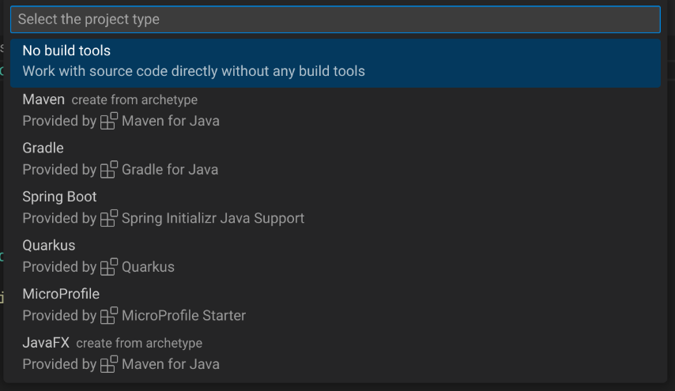
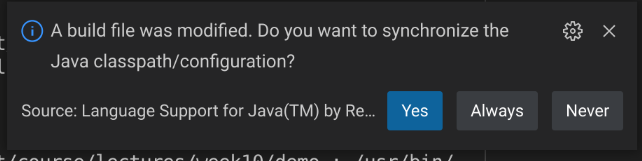

Create a new software project
=============================

::: outcomes

* [X] Create a new empty software project that includes a build and dependency
  management tool.
    * [X] Add and use a new dependency in a software project.

:::

We've previously installed the extension pack for Java in VS Code. This actually
comes with "Maven for Java". Let's learn how to use that to create a new project
with Maven.

Maven
-----

So far we've talked about dependency management (with Python's `pip`) and build
management (with `make`).

[Maven] is both a dependency and build management tool. Where `pip` is pretty
minimal (it only downloads dependencies and their dependencies and their
dependencies and their dependencies and...), and `make` is... `make`, Maven is
pretty comprehensive in what it does.

When we looked at `make`, one thing you might notice is that `make` has very few
opinions about how you should create a `Makefile`. Yeah, we've got the idea of
rules, targets, dependencies, commands, but you kind of have to do everything
yourself. If you want a `clean` target, you have to write it. If you want an
`all` target, you have to write it. While I might like to call my `clean` target
`clean`, someone else might call it `cleanup`, and the only way we can reliably
know is to look at the `Makefile` and read it. This is a long way to say that
`make` is extremely unopinionated about everything except for tabs vs spaces.

Maven, on the other hand is extremely opinionated:

* A Java project that uses Maven must adhere to a very specific folder structure
  (`src/main/java`, `src/test/java`, etc).
* Maven has well-known and specified names for "goals" (`clean`, `package`,
  etc).

Ideally this gets you two things:

1. If you know how to build and use one Maven project, you know how to build and
   use all projects that use Maven (in theory), and
2. You can do pretty complex things with very little configuration (in theory).

[Maven]: https://maven.apache.org/

Create a project in VS Code
---------------------------

Let's dive in. Start by opening VS Code. Normally you would create a new file in
VS Code using something like <kbd>Control</kbd> or <kbd>Command</kbd> and
<kbd>N</kbd>, or you would use the File &rarr; New File... menu, or you would
create a new file by right clicking in the Explorer area and selecting New
File... from the menu.

We're going to do something a little bit different this time: we're going to
open the "command palette" in VS Code. You can open the command palette by
pressing:

* <kbd>Control</kbd>+<kbd>Shift</kbd>+<kbd>P</kbd> in Windows or Linux, or
* <kbd>Command</kbd>+<kbd>Shift</kbd>+<kbd>P</kbd> in macOS.

The command palette lets you type in generally what you want to do and gives
suggestions. Let's create a new Maven Java project:

1. Start by beginning to type, then selecting "Create Java Project...".
2. Select "Maven <small>Create from archetype</small>".

   
3. Select "`maven-archetype-quickstart`".

   
4. You can choose any version here, but I would recommend version 1.4.

   
5. Next you're going to get to enter two values: a "group Id" and an "artifact
   Id". 

   

   Group Id
   : Sort of like the organization or ... group where one or more projects are
     related to each other. 
   : Is often a domain name reversed (e.g., `ca.umanitoba.cs.www`).

   Artifact Id
   : The name of the project that you're going to build.

   You're welcome to use the default values for this (`com.example` and `demo`)
   but when you create your own projects later you should pick more meaningful
   group and artifact Ids.
6. VS Code is going to prompt you to choose a directory where this project is
   going to live. Maven is going to create a new directory with the same name as
   the artifact Id within the folder you select.

   ::: warning

   The first time you do this, Maven is going to download a *bunch* of stuff.
   This may take several minutes to complete.

   :::
7. You can monitor the progress of what's happening in the terminal that opens
   at the bottom of your VS Code window. Eventually, Maven is going to prompt
   you to enter a version number for your project:

   

   ::: aside

   Why didn't it ask when asking for group and artifact Ids?!

   :::

   You can safely accept the default by pressing <kbd>Enter</kbd>, or you can
   enter something different.

   ::: aside

   There are [two hard problems in computer science]:

   1. Naming things.
   3. Cache invalidation.
   2. Off-by-one errors.
   4. Guaranteed order of message delivery.
   5. Versioning.

   One popular way to version your code is to use [semantic versioning].

   [two hard problems in computer science]:
   https://www.martinfowler.com/bliki/TwoHardThings.html
   [semantic versioning]: https://semver.org/

   :::
8. Finally, (finally!), you can confirm the group and artifact Ids and the
   version number that you selected by pressing <kbd>Enter</kbd>:

   

If everything has worked out, your VS Code should now have the project open,
and your explorer pane should show some folders and files:


In the "Java Projects" pane, expand `src/main/java`, then `com.example` (or
whatever group Id you picked, this is the prefix of your package names in your
project now), and open `App`. :tada:, you just created a new Java project with
Maven support.

Adding dependencies
-------------------

Ok? Awesome? This was a lot of work to not have to type in a "Hello, world!"
project in Java.

Yeah, OK, so you not having to type in `public static void main(String[] args)`
is fine, it's not exactly a major benefit justifying the existence of Maven.

One of the major reasons to want to use Maven is to very quickly be able to
download and use dependencies to your Java projects. Dependencies in Java are
kind of painful in a way that they aren't in Python with `pip`: you have to
download a JAR file, put the JAR file near your `.java` and `.class` files,
configure your `CLASSPATH`... It's not great.

Adding a new dependency to a Java project using Maven is straightforward.

Open the file named `pom.xml`, this file got created when you created the
project.

`pom.xml` is the configuration file for your project that Maven uses to do
things like specify the dependencies for your project.

We're going to do two things here:

1. Find out how to find dependencies.
2. Add the dependency to our `pom.xml`.

Let's actually start by breaking our Java program: replace the contents of
`App.java` with the following:

```java
package com.example;

import org.json.JSONStringer;

/**
 * Hello world!
 *
 */
public class App {
    public static void main(String[] args) {
        JSONStringer stringer = new JSONStringer();
        System.out.println(stringer.object()
								   .key("Hello")
                                   .value("world")
                                   .endObject().toString());
    }
}
```

This is a small chunk of code that will create a [JSON] object; it's not exactly
important what the code is doing, just that it requires a dependency
(`org.json`).

### Finding dependencies

Some projects will straight-up give you the information that you need to add
them as a dependency to your `pom.xml`, but we'll look at a way to find a
dependency.

Start by opening your web browser and going to <https://mvnrepository.com>. This
is a comprehensive listing of dependencies that you can use in your Java
project.

Let's look specifically for something to help us use [JSON] in our project. At
the top of the page is a search field, enter "json" and press <kbd>Enter</kbd>.

The first artifact that's listed is `json` with a group Id of `org.json`. Click
on [`json`]. You're going to see lots of versions, click on the most recent
version at the top of the table.

In the middle of this page is a tabbed view with different tool names (Maven,
Gradle, Gradle, Gradle, SBT, Ivy, ...). Maven is the default. There's a text
area here where you can select some text. This is XML, the same format as
`pom.xml`. Click on the text area and it *should* automatically copy this to
your clipboard. If it doesn't, highlight the text and copy it.

### Add the dependency to `pom.xml`

Now switch back to VS Code, open `pom.xml`, and add this dependency below the
`</dependency>` for `junit`:

```xml
<dependencies>
  <dependency>
    <groupId>junit</groupId>
    <artifactId>junit</artifactId>
    <version>4.11</version>
    <scope>test</scope>
  </dependency>
  <!-- https://mvnrepository.com/artifact/org.json/json -->
  <dependency>
    <groupId>org.json</groupId>
    <artifactId>json</artifactId>
    <version>20220924</version>
  </dependency>
</dependencies>
```

As soon as you save, VS Code is going to ask if you want to "synchronize" the
project:



You do! Click "Yes"!

Now go back to `App.java`. It compiles! Run the program the way you did when you
were debugging!

You just added a dependency to a Java project and used that dependency :tada:!

[`json`]: https://mvnrepository.com/artifact/org.json/json
[JSON]: https://en.wikipedia.org/wiki/JSON

Further reading
---------------

We've done the bare minimum here with Maven, but it's enough to get us started.

You can read more about this in a few places:

* [VS Code's documentation for Java projects] gives you some more about using VS
  Code for Java development, including more about how to use the Maven for Java
  extension.
* The [Maven] home page has comprehensive documentation about how to use Maven.
* You can read more about other build and dependency management tools like
  [Gradle], [Ivy], or [Ant]. Gradle is popular because it's typically the build
  and dependency management tool used for Android app development.

[VS Code's documentation for Java projects]:
https://code.visualstudio.com/docs/java/java-project
[Gradle]: https://gradle.org/
[Ivy]: https://ant.apache.org/ivy/
[Ant]: https://ant.apache.org
